# OSP Hardware Getting Started Guide (macOS installer) \- Release 2020b <!-- omit in toc -->

For the *Quick Start Guide*, go to this [link to the PDF](https://drive.google.com/file/d/1Q6VIWwYGnjLXZDoGF__KdsRDg5Nd6haC/view?usp=sharing).

This document is a more detailed version of the Quick Start Guide that covers the installation steps in greater detail and goes over the sanity checks needed to ensure that both versions of the software installed in the hardware, the embedded webserver (EWS), 

&nbsp;

## **Table of Contents**
- [**Table of Contents**](#table-of-contents)
- [**1 Installation Requirements**](#1-installation-requirements)
- [**2 Installation Steps**](#2-installation-steps)
- [**3 Quick Introduction to OSP Software**](#3-quick-introduction-to-osp-software)
- [**4 Sanity Check - Node.js version of EWS**](#4-sanity-check---nodejs-version-of-ews)
- [**5 Sanity Check - PHP/Laravel version of EWS**](#5-sanity-check---phplaravel-version-of-ews)
- [**6 Resources and Acknowledgements**](#6-resources-and-acknowledgements)
- [**7 Bibliography**](#7-bibliography)
<!-- To be included here. -->
&nbsp;  

## **1 Installation Requirements**
([back to table of contents](#table-of-contents)) <!-- omit in toc -->
&nbsp;  

The following is essential hardware for this installation.
1. **The PCD (Processing and Communication Device, "the device")**  
It's a small wearable box that contains:
    * a smartphone chipset performing all the signal processing and wireless communication functions
    * a battery
    * supporting hardware  

    The installation steps in this guide will refer to the PCD as "the device".  

    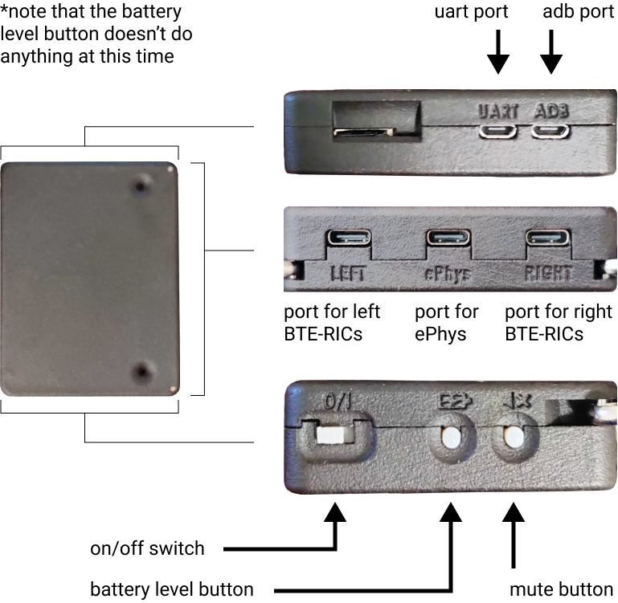

&nbsp;  

2. **BTE-RICs (Behind-the-Ear, Receivers-in-Canal)**  
These are "hearing aid"-style audio transducer devices that connect to the PCD via a 4-wire cable.  

    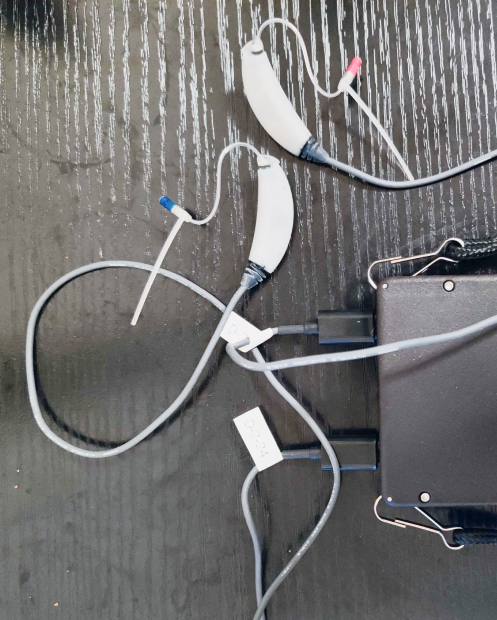

&nbsp;  

3. **1 micro-USB Cable**  
This may have a power adapter attached that is connected to an outlet, but it is sufficient by itself long as it can be connected to a reliable source of power.

    

&nbsp;  

4. **A Browser-Enabled Device**  
Ideally, you would have a computer that has a working browser, reliable wifi connectivity, and a terminal.

&nbsp;  

## **2 Installation Steps**
([back to table of contents](#table-of-contents)) <!-- omit in toc -->
&nbsp;  

1. The device should have some source of power to operate. While the device is off, plug in the micro-USB cable into the ADB port (Android Debug Port) of the device to charge it.

    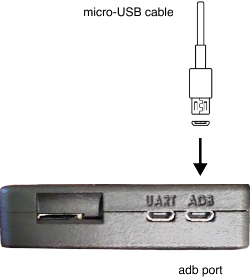

&nbsp;  

2. Plug in the BTE-RICs into the left and right ports on the side of the device, as shown below.

    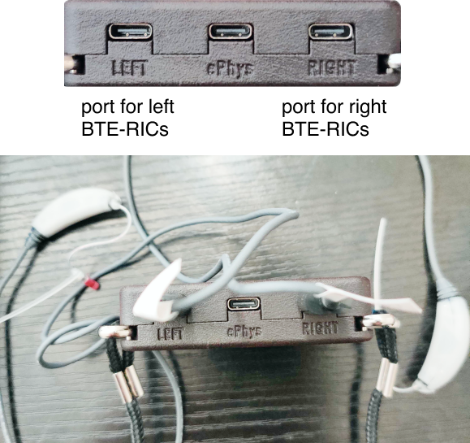

&nbsp;  

3. Now turn on the device by flicking the on/off switch on the device.

    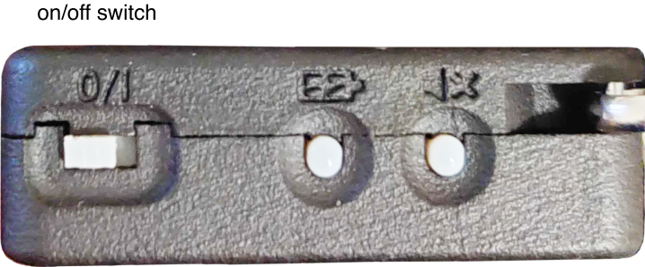

&nbsp;  

4. Once powered on, the device has a wifi hotspot called "ospboard" to connect to. Power on your browser-enabled device or computer and navigate to available wifi networks (on macOS, it should have the wifi icon in the upper-right hand side of your screen). Connect to the wifi network that says "ospboard" and, when prompted, enter "password" as the password.

    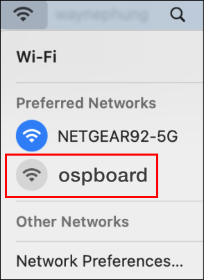

&nbsp;  

5. Open up a browser, such as Chrome, and type in one of the following in the search bar to access the embedded webserver (EWS).
    &nbsp;

    "**192.168.8.1:5000**" - This runs the Node.js version of EWS. It is highly recommended to use this version, as future updates and features to EWS will only be supported within Node.js.  

    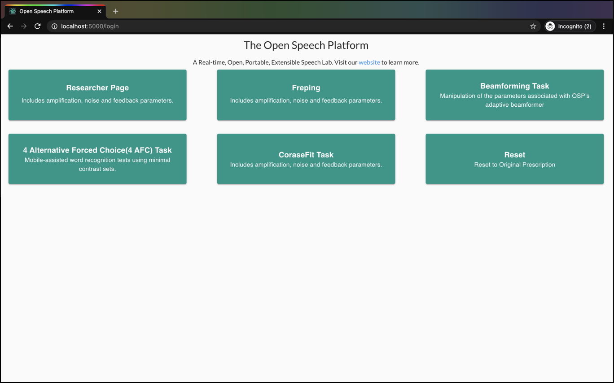

    &nbsp;  

    "**192.168.8.1**" - Optionally, you can access the PHP/Laravel version of EWS, but this is the legacy version of EWS which will eventually be replaced with the Node.js version.

    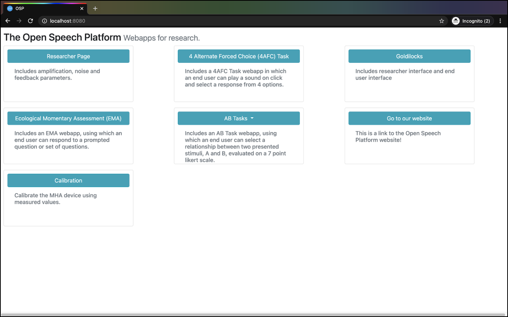

&nbsp;  

## **3 Quick Introduction to OSP Software**
([back to table of contents](#table-of-contents)) <!-- omit in toc -->
&nbsp;  

The software of the Open Speech Signal Processing Platform (OSP) consists of two main components:
1. **Real Time Master Hearing Aid (RT-MHA)** - This is the hearing-aid algorithm which takes the audio from the environment and modifies it for the listeners specific prescription.
2. **Embedded Web Server (EWS)** - This makes any web browser enabled device into a graphical user interface which can control the RT-MHA algorithm. There are two flavors of EWS available in this release written in two different programming languages, Node.js and PHP/Laravel. The Node.js version is currently being developed and will eventually replace all of the functionality found in the PHP/Laravel version.  

&nbsp;  

## **4 Sanity Check - Node.js version of EWS**
([back to table of contents](#table-of-contents)) <!-- omit in toc -->
&nbsp;  

This section describes steps that verify RT-MHA, Node.js version of EWS, and audio input/output work.
For PHP/Laravel version of EWS, see “**[5 Sanity Check - PHP/Laravel version of EWS](#5-sanity-check---phplaravel-version-of-ews)**”.

1. Check your browser that you’re in the right landing page. If not, type in “**192.168.8.1:5000**” in the browser search bar.  

&nbsp;

1. In the center below “Freping”, click on the button labeled “CoarseFit Task”.
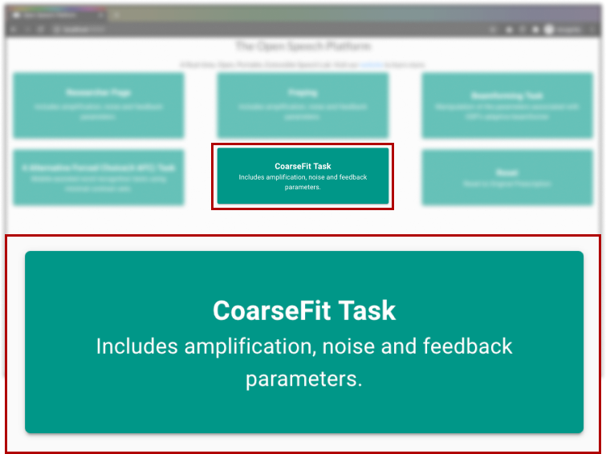

&nbsp;  

1. Choose any one of the three options in the CoarseFit Demo, scroll down. Notice the changes in the images and text. Then, click the “Next” button.  
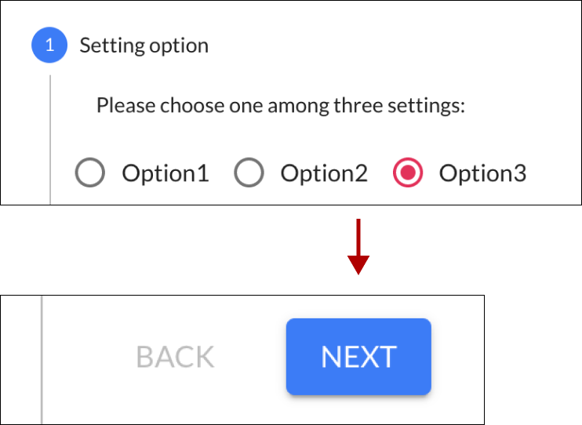

&nbsp;  

4. Choose one of the five hearing loss levels, which help change the volume heard. Then, click on the horizontal bar and select an audio file.  
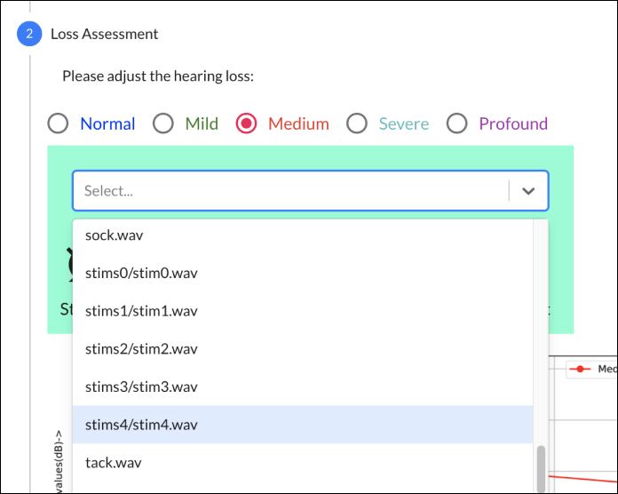

&nbsp;  

5. Below the audio file section and buttons, you should see changes to the graph based on the hearing loss levels chosen.  
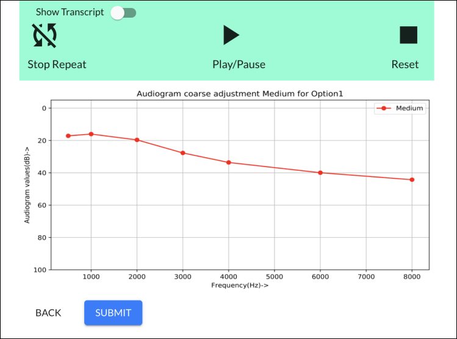

&nbsp;  

6. Get one of the BTE-RICs and hold it close to its intended ear. **DO NOT put it too close or inside your ear yet.**

    **Disclaimer: For people in general, BTE-RICs can become quite loud. You can risk damaging your ears. You must test the BTE-RICs to determine how loud they are before inserting them close or inside into your ears.**

    

    &nbsp;  

7. Press the “Play/Pause” button. To adjust how loud the audio file is, select different hearing loss levels until you can comfortably listen to the audio file.
  
    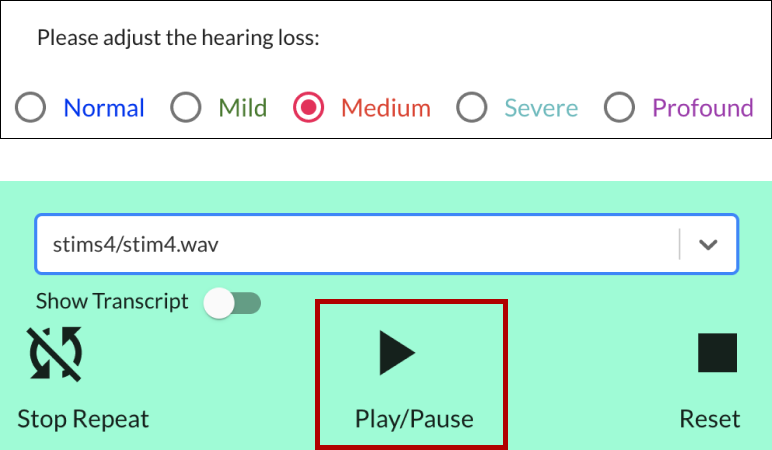

    &nbsp;  

8. You may insert both BTE-RICs close or into your ears. Play the audio file again and test the various buttons.

    **Note**: only the “stim#/stim#.wav” files have transcripts available. To view the transcript, click on the “Show Transcript” toggle.

    Click on the “Reset” button and play the audio file again. You should also be able to notice that the selected word heard and shown has a different shade of color (usually shown in red) during audio playback.  
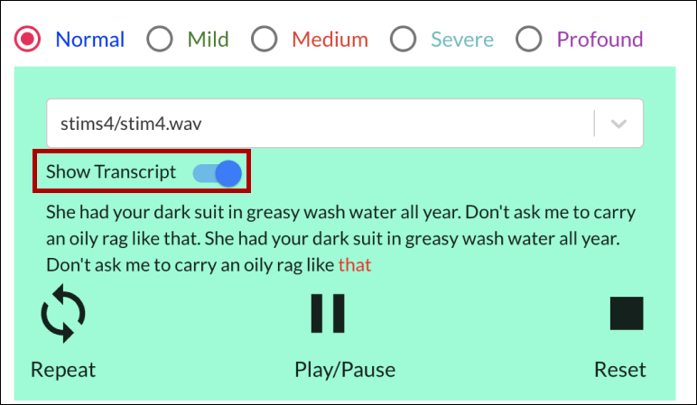

&nbsp;  

9. You should be finished with testing the demo. Clicking the “Submit” button takes you back to the landing page.  
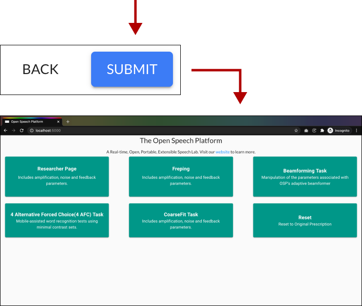

&nbsp;  

## **5 Sanity Check - PHP/Laravel version of EWS**
([back to table of contents](#table-of-contents)) <!-- omit in toc -->
&nbsp;  

This section describes steps that verify RT-MHA, PHP/Laravel version of EWS, and audio input/output work.
For Node.js version of EWS, see “**[4 Sanity Check - Node.js version of EWS](#4-sanity-check---nodejs-version-of-ews)**”.

1. Check your browser that you’re in the right landing page. If not, type in “**192.168.8.1**” in the browser search bar.  

&nbsp;  

2. In the upper-right hand corner, click on the button labeled “Researcher Page”.  
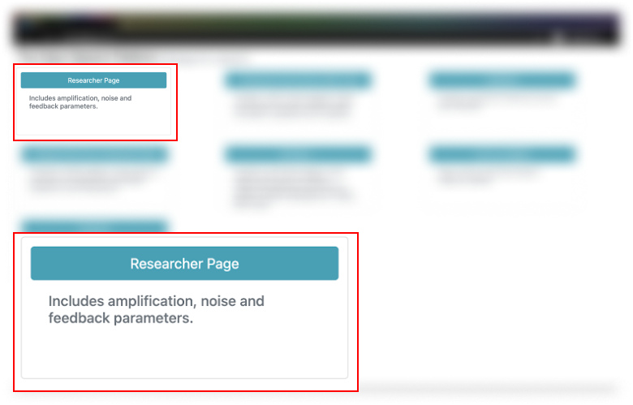

&nbsp;  

3. You should see this screen for the Researcher Page in the “Amplification” section.  
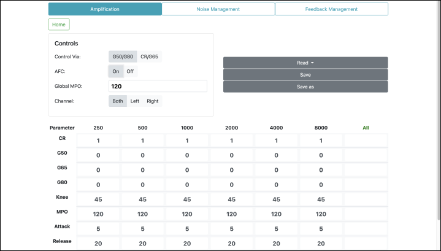

&nbsp;  

4. Get one of the BTE-RICs and hold it close to its intended ear. **DO NOT put it too close or inside your ear yet.**

    **Disclaimer: For people in general, BTE-RICs can become quite loud. You can risk damaging your ears. You must test the BTE-RICs to determine how loud they are before inserting them close or inside into your ears.**

    

    &nbsp;  

5. Scroll to the bottom of the page and click on the “Transmit” button. Then, scratch the BTE-RICs on the circled areas and listen for immediate audio feedback.  
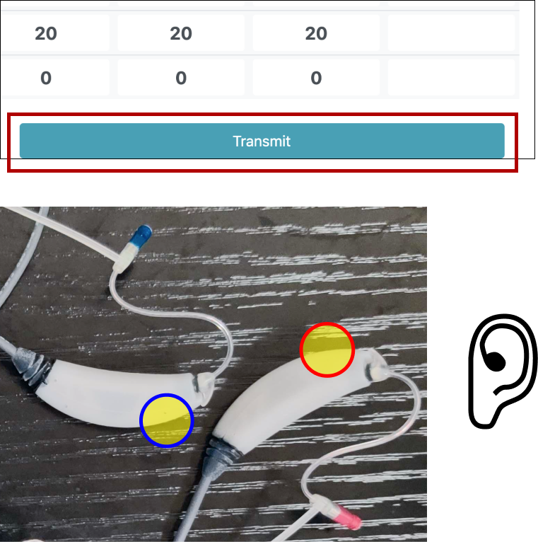

&nbsp;  

6. Scroll back up and view the “Controls” settings. Next to “Control Via:”, click on CR/G65. Then, in the boxed cell within the “All” column and “G65” row, type in “5”. Notice the change in values.

    Changing the value in the boxed cell to “5” should change the gain for “g65” to be 5 decibels (dB SPL) across all frequency bands (250 to 8000 Hertz).  
    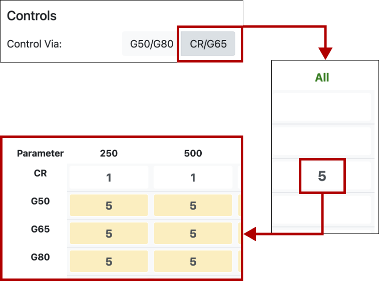

    &nbsp;  

7. Scroll to the bottom of the page and click on the “Transmit” button again. Scratch the BTE-RICs on the circled areas again and listen for immediate audio feedback. Notice the differences in volume. 

&nbsp;  

## **6 Resources and Acknowledgements**
([back to table of contents](#table-of-contents)) <!-- omit in toc --> 

Below are hyperlinks to OSP-related resources:
1. [**OSP Website**](http://openspeechplatform.ucsd.edu/) - General information of OSP.
2. [**OSP Forum**](http://openspeechplatform.ucsd.edu/forum/) - Community discussion of issues and suggestions for improving OSP.

**For setting up OSP software**, there are separate guides that cover the installation steps and sanity checks. Below are more hyperlinks:

1. [Software Quick Start Guide](OSP%20Software%20Documentation/OSP%20Software%20Quick%20Start%20Guide%20(macOS%20Installer)%20-%20Release%202020B.pdf) - Essential requirements and steps for installing and getting OSP software running.

2. [Software Getting Started Guide](OSP%20Software%20Documentation/OSP%20Software%20Getting%20Started%20Guide%20-%20Release%202020B.md) - Comprehensive guide to installing and testing OSP software. This guide covers the following, which are also available as separate guides.

   * Installation Requirements and Steps (included in the [Software Quick Start Guide](OSP%20Software%20Documentation/OSP%20Software%20Quick%20Start%20Guide%20(macOS%20Installer)%20-%20Release%202020B.pdf))

   * [Software Sanity Check - Audio Input and Output Sources](OSP%20Software%20Documentation/OSP%20Software%20Sanity%20Check%20-%20Audio%20Input_Output%20Sources%20(Release%202020B).pdf) - Guide to checking that your audio input and output sources are connected for OSP software usage.

   * [Software Sanity Check - Node.js Version of EWS](OSP%20Software%20Documentation/OSP%20Software%20Sanity%20Check%20-%20Nodejs%20Version%20of%20EWS%20(Release%202020B).pdf) - Guide to testing that the Node.js version of the embedded web server (EWS) works as intended.

   * [Software Sanity Check - PHP/Laravel Version of EWS](OSP%20Software%20Documentation/OSP%20Software%20Sanity%20Check%20-%20PHP:Laravel%20Version%20of%20EWS%20(Release%202020B).pdf) - Guide to testing that the PHP/Laravel version of the embedded web server (EWS) works as intended.

   * [Software Troubleshooting Guide](OSP%20Software%20Documentation/OSP%20Software%20Troubleshooting%20Quick%20Start%20Guide%20(macOS%20Installer)%20-%20Release%202020B.pdf) - Covers steps for possible issues during OSP software installation.

This work is supported by:
* NIH  R33-DC015046:  Self-fitting  of  Amplification:  Methodology  andCandidacy
* NIH R01-DC015436:  A Real-time, Open, Portable, Extensible SpeechLab to University of California, San Diego.
* NSF IIS-1838830:  Division of Information & Intelligent Systems,  ”AFramework  for  Optimizing  Hearing  Aids  In  Situ  Based  on  PatientFeedback, Auditory Context, and Audiologist Input”
* The Qualcomm Institute

&nbsp;  

## **7 Bibliography**
([back to table of contents](#table-of-contents)) <!-- omit in toc --> 

1. Harinath Garudadri, Arthur Boothroyd, Ching-Hua Lee, Swaroop
Gadiyaram, Justyn Bell, Dhiman Sengupta, Sean Hamilton, Krishna Chaithanya Vastare, Rajesh Gupta, and Bhaskar D. Rao, "A
Realtime, Open-Source Speech-Processing Platform for Research in
Hearing Loss Compensation", In Signals, Systems and Computers,
2017 51st Asilomar Conference, IEEE, 2017.
2. James M. Kates, "Principles of digital dynamic-range compression," Trends in Amplification, vol. 9, no.2, pp. 45-76, 2005.
3. Shilpi Banerjee, The compression handbook: An overview of the
characteristics and applications of compression amplification, 4th
Edition, Starkey Laboratories, 2017.
4. James M. Kates, Digital hearing aids, Plural publishing, 2008.
5. Toon van Waterschoot and Marc Moonen, "Fifty years of acoustic
feedback control: State of the art and future challenges," Proceedings of IEEE, vol. 99, no. 2, pp. 288-327, 2011.
6. Johan Hellgren, "Analysis of feedback cancellation in hearing
aids with Filtered-x LMS and the direct method of closed loop
identification," IEEE Transactions on Speech and Audio Processing,
vol. 10, no. 2, pp. 119-131, 2002.
7. Hsiang-Feng Chi, Shawn X. Gao, Sigfrid D. Soli, and Abeer Alwan,
"Band-limited feedback cancellation with a modified filtered-X
LMS algorithm for hearing aids," Speech Communication, vol. 39,
no. 1-2, pp. 147-161, 2003.
8. Donald L. Duttweiler, "Proportionate normalized least-meansquares adaptation in echo cancelers," IEEE Transactions on
Speech and Audio Processing, vol. 8, no. 5, pp. 508-518, 2000.
9. Jacob Benesty and Steven L. Gay, âAIJAn improved PNLMS al- ˘
gorithm,âA˘ I in Proceedings of IEEE International Conference on ˙
Acoustic, Speech, and Signal Processing (ICASSP), pp. 1881-1884, 2002.
10. Constantin Paleologu, Jacob Benesty, and Silviu CiochinÄC, "An ˇ
improved proportionate NLMS algorithm based on the l0 norm,"
in Proceedings of IEEE International Conference on Acoustic,
Speech, and Signal Processing (ICASSP), pp. 309-312, 2010.
11. Arslan, Levent, Alan McCree, and Vishu Viswanathan. "New
methods for adaptive noise suppression." Acoustics, Speech, and
Signal Processing, 1995. ICASSP-95., 1995 International Conference
on. Vol. 1. IEEE, 1995.
12. Hirsch, Hans-GÃijnter, and Christoph Ehrlicher. "Noise estimation
techniques for robust speech recognition." Acoustics, Speech, and
Signal Processing, 1995. ICASSP-95., 1995 International Conference
on. Vol. 1. IEEE, 1995.
13. Cohen, Israel, and Baruch Berdugo. "Noise estimation by minima
controlled recursive averaging for robust speech enhancement."
IEEE signal processing letters 9.1 (2002): 12-15.
14. Lee, Ching-Hua, Bhaskar D. Rao, and Harinath Garudadri. "Sparsity promoting LMS for adaptive feedback cancellation". In Signal
Processing Conference (EUSIPCO), 2017 25th European, pp. 226-230. IEEE, 2017.

&nbsp;  