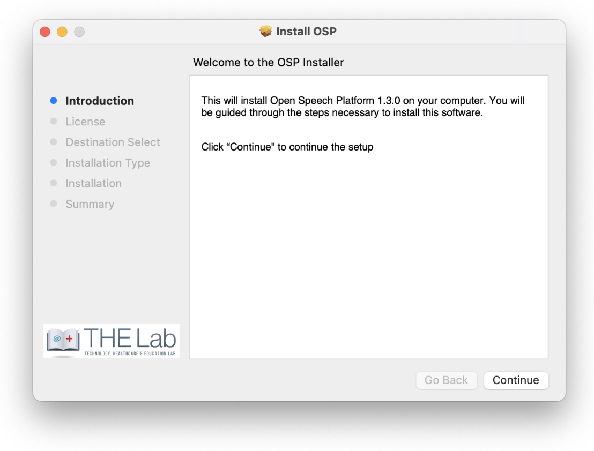
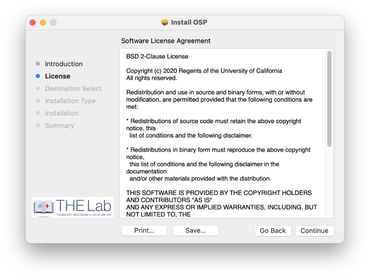
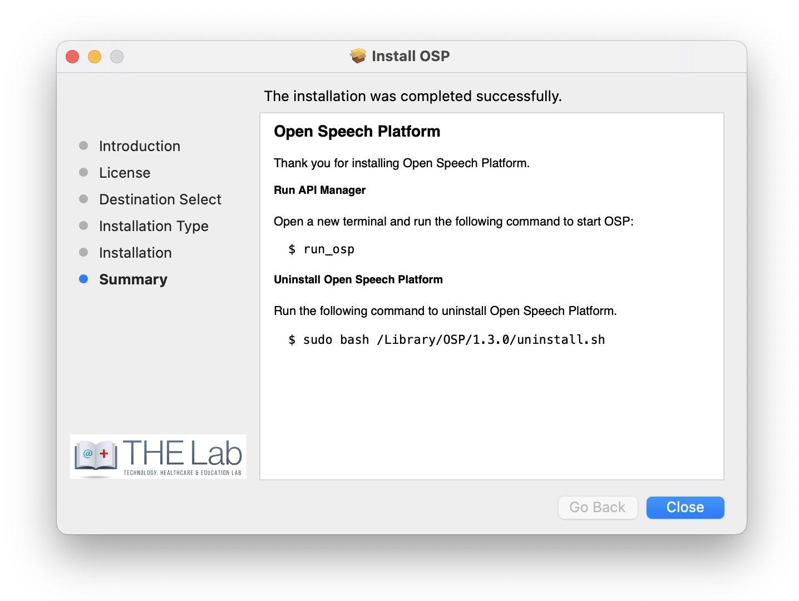
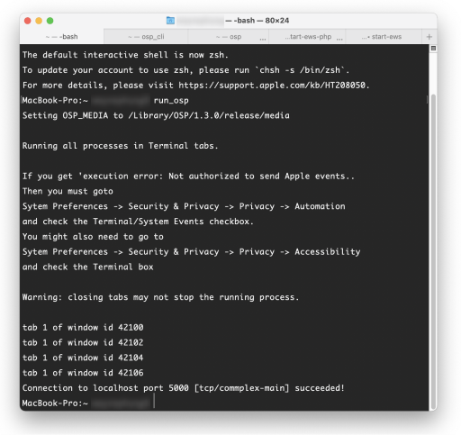
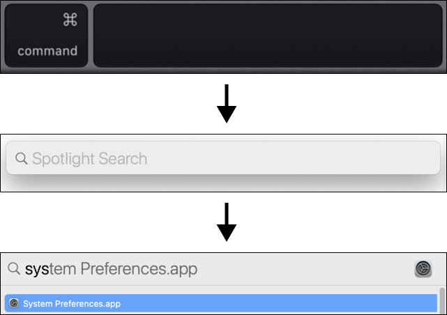
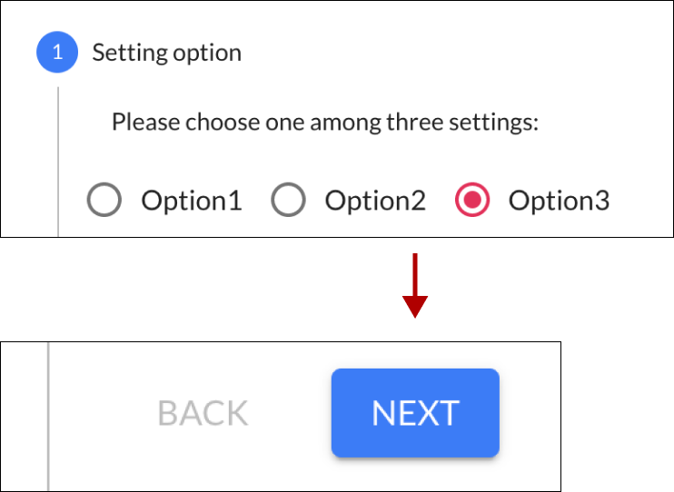
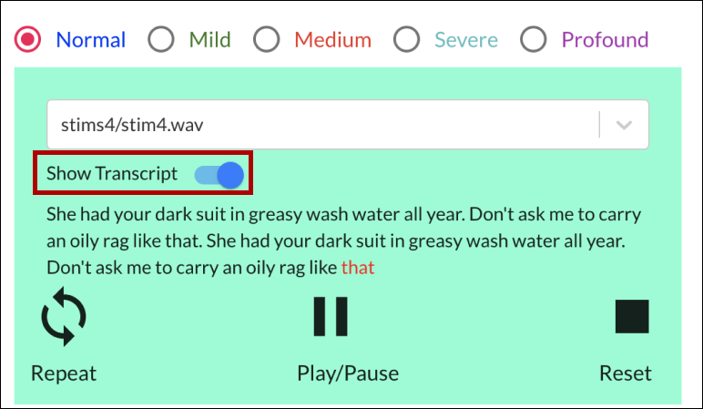
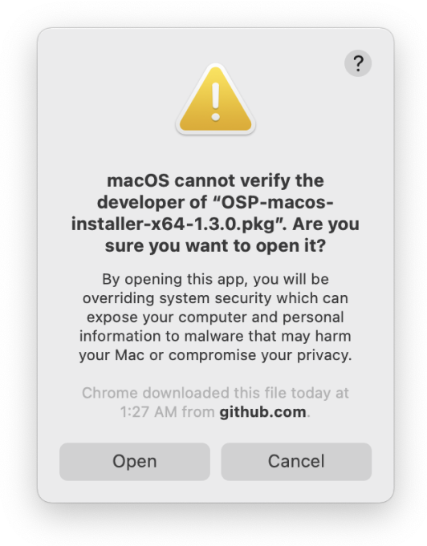
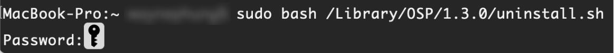

# OSP Software Getting Started Guide (macOS installer) \- Release 2020b <!-- omit in toc -->

For the *Quick Start Guide*, go to this [link to the PDF](https://drive.google.com/file/d/1Ol7RJoPELA8QKnMIM5VuQj4XZ8BZ40xU/view?usp=sharing).

This document is a more detailed version of the Quick Start Guide that covers the installation steps and sanity checks in greater detail, troubleshooting sections for resolving installation issues, and sanity checks for verifying functionality of OSP software.

## **Table of Contents**
- [**Table of Contents**](#table-of-contents)
- [**1 Quick Introduction to OSP Software**](#1-quick-introduction-to-osp-software)
- [**2 Installation Requirements**](#2-installation-requirements)
- [**3 Installation Steps**](#3-installation-steps)
- [**4 Sanity Check - Making Sure Audio Input and Output Works**](#4-sanity-check---making-sure-audio-input-and-output-works)
- [**5 Sanity Check - Node.js version of EWS**](#5-sanity-check---nodejs-version-of-ews)
- [**6 Sanity Check - PHP/Laravel version of EWS**](#6-sanity-check---phplaravel-version-of-ews)
- [**7 Troubleshooting \- Can’t Open Installer Window**](#7-troubleshooting---cant-open-installer-window)
- [**8 Troubleshooting \- Terminal Tabs Won’t Open**](#8-troubleshooting---terminal-tabs-wont-open)
- [**9 Uninstalling OSP**](#9-uninstalling-osp)
- [**10 Resources and Acknowledgements**](#10-resources-and-acknowledgements)
- [**11 Bibliography**](#11-bibliography)

## **1 Quick Introduction to OSP Software**
([back to table of contents](#table-of-contents)) <!-- omit in toc -->
&nbsp;  

The software of the Open Speech Signal Processing Platform (OSP) consists of two main components:
1. **Real Time Master Hearing Aid (RT-MHA)** - This is the hearing-aid algorithm which takes the audio from the environment and modifies it for the listeners specific prescription.
2. **Embedded Web Server (EWS)** - This makes any web browser enabled device into a graphical user interface which can control the RT-MHA algorithm. There are two flavors of EWS available in this release written in two different programming languages, Node.js and PHP/Laravel. The Node.js version is currently being developed and will eventually replace all of the functionality found in the PHP/Laravel version.  

&nbsp;  

## **2 Installation Requirements**
([back to table of contents](#table-of-contents)) <!-- omit in toc -->
&nbsp;  

The following is essential for installing OSP.
1. MacOS computer with a working browser, wifi connection, and terminal.
2. at least 800 MB of free storage space
3. In "System Preferences", you need to enable different privacy permissions
&nbsp;

**One** of the following is essential for checking if OSP works after installation.
1. A headset or pair of wired headphones.
2. Your computer’s built-in microphone and speakers.

_Note that audio input (mic) and output (volume) should not muted._

## **3 Installation Steps**
([back to table of contents](#table-of-contents)) <!-- omit in toc -->
&nbsp;  

1. Go to this link to the ["Release" folder in Google Drive](https://drive.google.com/drive/folders/1NjtwBNzf2SkYOxKLAYshZf0nhyLz3Y0z?usp=sharing) to find and download an installer file of the latest version number (end of the file name should have ".pkg").
2. Right on the file and select "Download" from the context menu.  
    

    Once you open the file, If you receive a message “(file name).pkg cannot be opened because it is from an unidentified developer”, see “**[7 Troubleshooting \- Can’t Open Installer Window](#7-troubleshooting---cant-open-installer-window)**”  section in the Getting Started Guide.
3. You should see this installer window opened. Follow the instructions shown.  

4. Read the Software License Agreement and agree to the terms.  

5. Enter your password used to sign in to your 
computer to continue the installation.

6. Wait for the installation to complete. Time will vary.  

7. You should see this window to confirm that OSP installation completed successfully.  

8. Follow the installer window instructions by opening a new terminal. To do so, you can simultaneously press the command and spacebar keys on your keyboard to open Spotlight Search, which looks like a long horizontal area in your screen with a Search icon.

9. Type in “terminal”, and the application should show up automatically.  

10. In the terminal, enter the command “`run_osp`”. You should see five terminal tabs automatically opened, running processes, and generating messages.

    If you don’t see these tabs and/or get an error message ““execution error”: Not authorized to send Apple events...”, see “**[8 Troubleshooting \- Terminal Tabs Won’t Open](#8-troubleshooting---terminal-tabs-wont-open)**".  

    You would be automatically redirected to your browser, where you'll see the landing page for Node.js version of EWS (URL should be “**localhost:5000/login**”). It is highly recommended to use this version, as future updates and features to EWS will only be supported within Node.js.  

    

    &nbsp;
1.  (optional) To access the PHP/Laravel version of EWS, enter “**localhost:8080**” in your browser search bar. The landing page should look like the following.  

    

&nbsp;

## **4 Sanity Check - Making Sure Audio Input and Output Works**
([back to table of contents](#table-of-contents)) <!-- omit in toc -->
&nbsp;  

This guide describes where to locate audio input and output sources in your macOS computer as well as using the "osp - cli" tab in the terminal to hear audio output. Describing the different settings for each of them is beyond the scope of this guide.

1. Check, and connect, to desired audio input (mic) and output (volume).

    There are two ways to access your Mac computer settings for audio input and output sources: **System Preferences and Audio MIDI Setup.**

    **For System Preferences**  

    * Press the command and spacebar keys on your keyboard to open Spotlight Search and start typing “system preferences”. The app name will be highlighted. Press enter.

        

    * You should see this interface of the System Preferences. Then, click on “Sound”.

        

    * There are tabs labeled “Output” and “Input”, where you can connect available audio microphone input and volume output sources. **Ensure that both audio input and output are not set to mute.**

        
    &nbsp;

    **For Audio MIDI Setup**

    * Press the command and spacebar keys on your keyboard to open Spotlight Search and start typing “audio midi setup”. The app name will be highlighted. Press enter.

        

    * The image below is the Audio MIDI Setup interface, where you can connect your audio sources for microphone input and volume output and make other changes to sound settings. **Ensure that both audio input and output are not muted.**

        

    &nbsp;

2. After you connected your desired audio sources, press the command and spacebar keys on your keyboard to open Spotlight Search.  

3. Type in “terminal”, and the application should show up automatically.  

4. In the terminal, enter the command “`run_osp`”. You should see 5 terminal tabs automatically opened,  running processes, and generating messages.  

5. Click on the tab named “osp_cli”, enter the command “`play`”, and press return/enter.  

    You should hear an audio file played. The file is named “tomsdiner.wav”.

    You should see parameters shown and the word “success” being shown.

    

6. To immediately stop the audio file playing, type in the command “`stop`” and press return/enter.  
    

&nbsp;  

## **5 Sanity Check - Node.js version of EWS**
([back to table of contents](#table-of-contents)) <!-- omit in toc -->
&nbsp;  

This section describes steps that verify RT-MHA, Node.js version of EWS, and audio input/output work.
For PHP/Laravel version of EWS, see “**[6 Sanity Check - PHP/Laravel version of EWS](#6-sanity-check---phplaravel-version-of-ews)**”.

1. Check your browser that you’re in the right landing page. If not, type in “localhost:5000” in the browser search bar.  

1. In the center below “Freping”, click on the button labeled “CoarseFit Task”.

3. Choose any one of the three options in the CoarseFit Demo, scroll down. Notice the changes in the images and text. Then, click the “Next” button.  

4. Choose one of the five hearing loss levels, which help change the volume heard. Then, click on the horizontal bar and select an audio file.  

5. Below the audio file section and buttons, you should see changes to the graph based on the hearing loss levels chosen.  

6. At this point, you should have an audio input and output source connected to your computer and ready for listening. If not, go back to "[1\-3 Sanity Check - Making Sure Audio Input and Output Works](#1-3-sanity-check---making-sure-audio-input-and-output-works)" to connect your audio sources. If you have an external headset, please connect it via Bluetooth or through your computer’s audio jack.  

    
    

7. Press the “Play/Pause” button and listen for audio feedback. Adjust the volume on your computer accordingly until you can comfortably listen to the audio file.  

8. Play the audio file again, listen, and test the various buttons.

    **Note**: only the “stim#/stim#.wav” files have transcripts available. To view the transcript, click on the “Show Transcript” toggle.

    Click on the “Reset” button and play the audio file again. You should also be able to notice that the selected word heard and shown has a different shade of color (usually shown in red) during audio playback.  

9. You should be finished with testing the demo. Clicking the “Submit” button takes you back to the landing page.  

&nbsp;  

## **6 Sanity Check - PHP/Laravel version of EWS**
([back to table of contents](#table-of-contents)) <!-- omit in toc -->
&nbsp;  

This section describes steps that verify RT-MHA, PHP/Laravel version of EWS, and audio input/output work.
For Node.js version of EWS, see “**[5 Sanity Check - Node.js version of EWS](#5-sanity-check---nodejs-version-of-ews)**”.

1. Check your browser that you’re in the right landing page. If not, type in “localhost:8080” in the browser search bar.  

2. In the upper-right hand corner, click on the button labeled “Researcher Page”.  

3. You should see this screen for the Researcher Page in the “Amplification” section.  

4. At this point, you should have an audio input and output source connected to your computer and ready for listening. If not, go back to [1\-3 Sanity Check - Making Sure Audio Input and Output Works](#1-3-sanity-check---making-sure-audio-input-and-output-works) to connect your audio sources. If you have an external headset, please connect it via Bluetooth or through your computer’s audio jack.

    
    

5. Scroll to the bottom of the page and click on the “Transmit” button. Then, speak into your computer or headset’s microphone and listen for immediate audio feedback.  

6. Scroll back up and view the “Controls” settings. Next to “Control Via:”, click on CR/G65. Then, in the boxed cell within the “All” column and “G65” row, type in “5”. Notice the change in values.

    Changing the value in the boxed cell to “5” should change the gain for “g65” to be 5 decibels (dB SPL) across all frequency bands (250 to 8000 Hertz).  
    

7. Scroll to the bottom of the page and click on the “Transmit” button again. Speak into your computer or headset’s microphone and listen for immediate audio feedback. Notice the differences in volume.  

&nbsp;  

## **7 Troubleshooting \- Can’t Open Installer Window**
([back to table of contents](#table-of-contents)) <!-- omit in toc -->
&nbsp;  

Refer to this section if you don’t see the OSP installer window open, and instead see an “Unidentified Developer” message in step 2 of "**[3 Installation Steps](#3-installation-steps)**". This would mean you need to change permissions on your computer to allow the installer to run.  

1. Press the command and spacebar keys on your keyboard to open Spotlight Search and start typing “system preferences”. The app name will be highlighted. Press enter.

    

2. Go to "Security and Privacy".

    

3. In the “General” tab, you should see the “unidentified developer” message here as well. Click the “Open Anyway” button.

    

4. If you receive this popup, confirm by pressing the “Open” button.  

    

5. You should see this installer window opened. Proceed to Step 3 within [1\-2 Installation Steps](#1-2-installation-steps).

    

&nbsp;  

## **8 Troubleshooting \- Terminal Tabs Won’t Open**
([back to table of contents](#table-of-contents)) <!-- omit in toc -->
&nbsp;  

Refer to this section if the five terminal tabs don’t open when you enter the “`run_osp`” command 
during step 10 of "**[3 Installation Steps](#3-installation-steps)**".

1. Follow the installer window instructions by opening a new terminal. To do so, you can simultaneously press the command and spacebar keys on your keyboard to open Spotlight Search, which looks like a long horizontal area in your screen with a Search icon. Type in "system preferences”, and the application should show up automatically.  
    

2. Go to "Security and Privacy".

    

3. Go to the “Privacy” Tab. On the left sidebar, scroll down to “Accessibility”, then click on the lock icon at the bottom.  
    

4. Use Touch ID or enter your password to unlock these settings.

    

5. Click on the checkbox next to Terminal to enable Terminal access. You should see a checkmark.  
    

6. Go to the left sidebar again and scroll down to “Automation”. Click on the checkbox next to “System Events.app”.

    

7. Go to the left sidebar again and scroll to “Microphone”. Check and/or click the checkbox next to “Terminal” to enable the Terminal access to the Microphone.

    

8. Then, click on the lock icon to save these changes. Return to step 10 of [1\-2 Installation Steps](#1-2-installation-steps) to try entering “run_osp” again.

    

    

&nbsp;  

## **9 Uninstalling OSP**
([back to table of contents](#table-of-contents)) <!-- omit in toc -->
&nbsp;  

1. First, find the version number. Have a terminal running and enter "`run_osp`" to launch OSP. Go to the “-bash” terminal tab, and find the “Setting OSP_MEDIA to /Library” message.  

1. Enter the command “`sudo bash /Library/OSP/1.2.3/uninstall.sh`”. Simply replace “`1.2.3`” with the version number you found. When prompted, enter your computer sign-in password.  

3. You will be asked if you want to proceed
uninstallation. To do so, type “y”.  
  

4. You should see the following message that the uninstall process has been finished.  

## **10 Resources and Acknowledgements**
([back to table of contents](#table-of-contents)) <!-- omit in toc -->  

Below are hyperlinks to OSP-related resources:
1. [OSP Website](http://openspeechplatform.ucsd.edu/) - General information of OSP.
2. [OSP Forum](http://openspeechplatform.ucsd.edu/forum/) - Community discussion of issues and suggestions for improving OSP.

This work is supported by:

* NIH  R33-DC015046:  Self-fitting  of  Amplification:  Methodology  andCandidacy
* NIH R01-DC015436:  A Real-time, Open, Portable, Extensible SpeechLab to University of California, San Diego.
* NSF IIS-1838830:  Division of Information & Intelligent Systems,  ”AFramework  for  Optimizing  Hearing  Aids  In  Situ  Based  on  PatientFeedback, Auditory Context, and Audiologist Input”
* The Qualcomm Institute 

&nbsp;   

## **11 Bibliography**
([back to table of contents](#table-of-contents)) <!-- omit in toc --> 

1. Harinath Garudadri, Arthur Boothroyd, Ching-Hua Lee, Swaroop
Gadiyaram, Justyn Bell, Dhiman Sengupta, Sean Hamilton, Krishna Chaithanya Vastare, Rajesh Gupta, and Bhaskar D. Rao, "A
Realtime, Open-Source Speech-Processing Platform for Research in
Hearing Loss Compensation", In Signals, Systems and Computers,
2017 51st Asilomar Conference, IEEE, 2017.
2. James M. Kates, "Principles of digital dynamic-range compression," Trends in Amplification, vol. 9, no.2, pp. 45-76, 2005.
3. Shilpi Banerjee, The compression handbook: An overview of the
characteristics and applications of compression amplification, 4th
Edition, Starkey Laboratories, 2017.
4. James M. Kates, Digital hearing aids, Plural publishing, 2008.
5. Toon van Waterschoot and Marc Moonen, "Fifty years of acoustic
feedback control: State of the art and future challenges," Proceedings of IEEE, vol. 99, no. 2, pp. 288-327, 2011.
6. Johan Hellgren, "Analysis of feedback cancellation in hearing
aids with Filtered-x LMS and the direct method of closed loop
identification," IEEE Transactions on Speech and Audio Processing,
vol. 10, no. 2, pp. 119-131, 2002.
7. Hsiang-Feng Chi, Shawn X. Gao, Sigfrid D. Soli, and Abeer Alwan,
"Band-limited feedback cancellation with a modified filtered-X
LMS algorithm for hearing aids," Speech Communication, vol. 39,
no. 1-2, pp. 147-161, 2003.
8. Donald L. Duttweiler, "Proportionate normalized least-meansquares adaptation in echo cancelers," IEEE Transactions on
Speech and Audio Processing, vol. 8, no. 5, pp. 508-518, 2000.
9. Jacob Benesty and Steven L. Gay, âAIJAn improved PNLMS al- ˘
gorithm,âA˘ I in Proceedings of IEEE International Conference on ˙
Acoustic, Speech, and Signal Processing (ICASSP), pp. 1881-1884, 2002.
10. Constantin Paleologu, Jacob Benesty, and Silviu CiochinÄC, "An ˇ
improved proportionate NLMS algorithm based on the l0 norm,"
in Proceedings of IEEE International Conference on Acoustic,
Speech, and Signal Processing (ICASSP), pp. 309-312, 2010.
11. Arslan, Levent, Alan McCree, and Vishu Viswanathan. "New
methods for adaptive noise suppression." Acoustics, Speech, and
Signal Processing, 1995. ICASSP-95., 1995 International Conference
on. Vol. 1. IEEE, 1995.
12. Hirsch, Hans-GÃijnter, and Christoph Ehrlicher. "Noise estimation
techniques for robust speech recognition." Acoustics, Speech, and
Signal Processing, 1995. ICASSP-95., 1995 International Conference
on. Vol. 1. IEEE, 1995.
13. Cohen, Israel, and Baruch Berdugo. "Noise estimation by minima
controlled recursive averaging for robust speech enhancement."
IEEE signal processing letters 9.1 (2002): 12-15.
14. Lee, Ching-Hua, Bhaskar D. Rao, and Harinath Garudadri. "Sparsity promoting LMS for adaptive feedback cancellation". In Signal
Processing Conference (EUSIPCO), 2017 25th European, pp. 226-230. IEEE, 2017.

&nbsp;  