# Open Speech Platform (OSP)

# Project Sponsor Nation Institute of Health, NIDCD

This work is supported by Nation Institute of Health, NIH/NIDCD grant R01DC015436, "A Real-time, Open, Portable, Extensible Speech Lab" to University of California, San Diego.

<!-- START doctoc generated TOC please keep comment here to allow auto update -->
<!-- DON'T EDIT THIS SECTION, INSTEAD RE-RUN doctoc TO UPDATE -->

## **Table of Contents**

- [Sponsorship](#sponsorship)
- [License](#license)
- [Overview](#overview)
  - [Real-Time Master Hearing Aid (RT-MHA) Software](#real-time-master-hearing-aid-rt-mha-software)
    - [Subband decomposition](#subband-decomposition)
    - [Wide Dynamic Range Compression](#wide-dynamic-range-compression)
    - [Automatic Feedback Control](#automatic-feedback-control)
    - [Speech Enhancement](#speech-enhancement)
    - [RTMHA Performance](#rt-mha-performance) 
  - [User Device Software](#user-device-software)
- [**OSP Installation**](#osp-installation)
  - [**Basic Installation**](#basic-installation)
  - [(Optional) Zoom TAC-8 Installation for Use with OSP](#optional-zoom-tac-8-installation-for-use-with-osp)
  - [**Running the system**](#running-the-system)
    - [Initial Test - 1](#initial-test---1)
    - [(Optional) Initial Test – 2 with Zoom tac-8](#optional-initial-test--2-with-zoom-tac-8)
  - [Changing Filter Coefficients](#changing-the-filter-coefficients)
  - [Using the Tablet Mode:](#using-the-tablet-mode)
    - [Setting Up Mac's Wi-fi](#setting-up-macs-wifi)
    - [Setting Up Android](#setting-up-android)
    - [Working with the Android app](#working-with-the-android-app)
  - [OSP - Jelly beans and BoB](#OSP--jelly-bean-and-bob)
    - [Jelly Beans](#jelly-beans)
    - [CS44 Cables](#cs44-cables)
    - [Breakout Board](#breakout-board)
    - [Setup Procedure](#setup-procedure)
    - [Troubleshooting](#troubleshooting)
    - [Single Ear Signal Path](#single-ear-signal-path)
  - [OSP – MATLAB Documentation](#osp--matlab-documentation)
- [API](#api)
- [References](#references)

<!-- END doctoc generated TOC please keep comment here to allow auto update -->

-----

## **Overview**
*This work is supported by the National Institute on Deafness and Other Communication Disorders, of the National Institute of Health (NIDCD/NIH). R01DC015436: "A Real-time, Open, Portable, Extensible Speech Lab" to the University of California, San Diego.*

The Open Speech Platform (OSP hereafter) is an open, reconfigurable, non-proprietary, wearable, realtime speech processing system suitable for audiologists and hearing aid researchers to investigate new hearing aid algorithms in lab and field studies.

The software modules in Release 2018a are depicted in Figure 1. It is possible to reconfigure this system during runtime and compilation. The system has been measured to run real-time on a MacBook with a round-trip latency of 7.98 ms [1]. This software will work adequately with off-the-shelf microphones and speakers; for clinical investigations, form-factor accurate ear level assemblies are recommended.

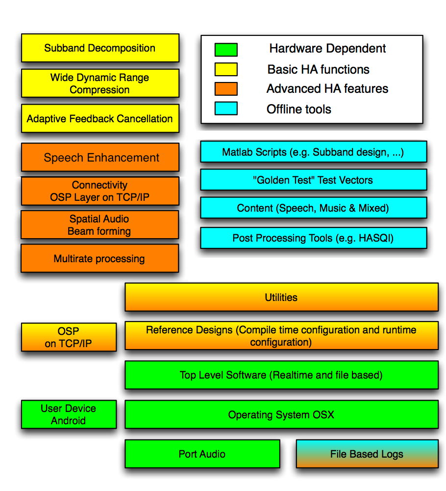

**Figure 1:** Software modules in Openspeechplatform_2018a_V1_0

**For Electrical Engineering and Computer Science Practitioners**: The reference design is provided in the files `osp_process.c` and `osp_process.h`. If you are working on alternate implementations of signal processing functions for use in hearing aids (HA), we suggest you clone a given function and call this in the reference design [1]. Keeping the interfaces same will minimize code changes – do not change the `.h` files unless you have a good reason. If you are adding additional functionality, implement it in `libosp` and modify the reference design accordingly.

**For Audiologists and Speech Scientists:** For runtime reconfiguration of the RT-MHA, the user device provides for real-time changes to WDRC parameters. If you do not have local help to extend the Android software to suit your needs, contact us with details of the clinical study and features you would like.

### Real-Time Master Hearing Aid (RT-MHA) Software
The software portion of OSP is the Real-Time Master Hearing Aid (RT-MHA). Its basic functions are: (i) Subband Decomposition, (ii) Wide Dynamic Range Compression, and (iii) Adaptive Feedback Cancellation. Its advanced features include: (i) Speech Enhancement, (ii) Connectivity over TCP/IP, (iii) Beamforming and (iv) Multirate Processing [1]. In this overview, we will provide brief descriptions of these functions and recommended references.

We will discuss the open source libraries developed for OSP. Figure 2 shows the block diagram of the RT-MHA software with signal flow. This architecture with different sampling rates (96 kHz or 48 kHz for I/O and 32 kHz for basic HA functions and processing) has the benefit of minimizing hardware latency and improving spatial resolution of beamforming with multiple microphones. Basic HA functions include subband decomposition, WDRC, and AFC. These algorithms are provided in source code and compiled libraries.

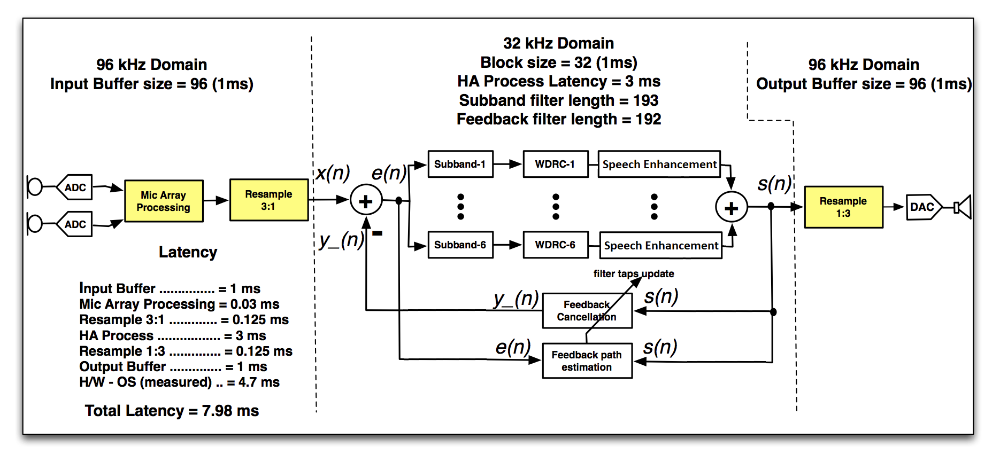

**Figure 2:** RT-MHA software block diagram with signal flow.

#### Subband Decomposition
In the RT-MHA, subband decomposition is provided to divide the full frequency spectrum into multiple frequency regions called “subbands”. This decomposition enables independent gain control of the HA system in each frequency region using different WDRC parameters. The decomposition is implemented as a bank of 6 finite impulse response (FIR) filters (Subband-1 to 6 in Figure 2) whose frequency responses are shown in Figure 3. Each of the 6 FIR filters has 193 taps, equivalent to a latency of ((193-1)/2)/32 kHz) = 3 ms. The filters are designed in MATLAB and the resulting filters are saved in `.flt` files for inclusion with the RT-MHA software. Bandwidths and upper and lower cut-off frequencies of these filters are determined according to a set of critical frequency values. It is possible for users to modify the MATLAB scripts to use FIR filters of different length and different number of subbands. This change requires recompiling the library.

**Figure 3:** Frequency response of the 6-channel filter bank.

#### Wide Dynamic Range Compression

The WDRC technique is one of the essential building blocks of a HA [2]. The purpose of a WDRC system is to modify the volume of the audio signal arriving at the user's ear in such a way as to make the output sound as audible, comfortable, and intelligible as possible for the user. At a high level, the WDRC amplifies quiet sounds (40-50 dB SPL), attenuates loud sounds (85-100 dB SPL), and applies a variable gain for everything in between [3]. In the RT-MHA, the WDRC algorithm is a based on a version of Prof. James Kates [4] and developed in MATLAB. We ported this module to ANSI C and provided as a library in source code. The implemented WDRC is a multi-channel system, in which the gain control is realized independently in each subband. The amount of gain in each subband is a frequency dependent, non-linear function of the input signal power. Basically, the overall WDRC algorithm is based on envelope detection (Peak Detector) and non-linear amplification (Compression Rule) as illustrated in Figure 4, with primary control parameters: compression ratio (CR), attack time (AT), release time (RT), and upper and lower kneepoints (K_{up} and K_{low}) [5]. In each subband, a peak detector tracks the envelope variations of the input subband signal and estimates the signal power accordingly. Then the amount of gain to apply will be determined based on a compression rule of the estimated input power level given by the peak detector. The AT and RT are illustrated in Figure 5, which are affected by the tracking ability of the peak detector. The CR, K_{up} and K_{low} are the control parameters for determining the compression rule, as shown in Figure 6. These WDRC parameters for each subband can be specified at compile time and changed at run time using the user device.

**Figure 4:** The WDRC system.

**Figure 5:** Attack time and release time illustration.

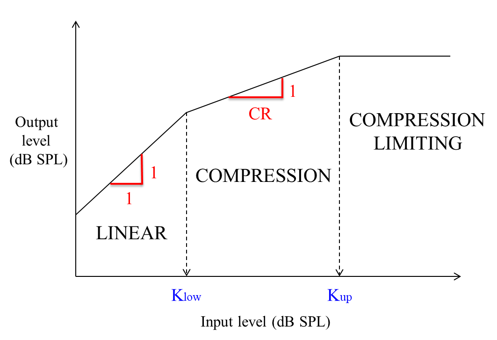

**Figure 6:** Input-output curve of the compression rule.

#### Automatic Feedback Control

Physical placement of the microphone and receiver in a HA device poses a major problem known as acoustic feedback [5]. This results from the acoustic coupling between the receiver and the microphone, in which the amplified signal through the receiver is collected by the microphone and re-amplified, causing severe distortion in the desired signal [5]. Consequently, it limits the available amount of amplification in a HA and disturbs the user due to the produced howling or whistling sounds. To overcome this problem, AFC has become the most common technique in modern HAs because of its ability to track the variations in the acoustic feedback path and cancels the feedback signal accordingly. Figure 7 depicts the AFC framework implemented in our RT-MHA system, which is mainly based on the Filtered-X Least Mean Square (FXLMS) method [6,7]. In this framework, the AFC filter *W*(*z*) is a finite impulse response (FIR) filter placed in parallel with the HA processing *G*(*z*) that continuously adjusts its coefficients to emulate the impulse response of the feedback path *F*(*z*). *x*(*n*) is the desired input signal and *d*(*n*) is the actual input to the microphone, which contains *x*(*n*) and the feedback signal *y*(*n*) generated by the HA output *s*(*n*) passing through *F*(*z*). *\hat{y}*(*n*) is the estimate of *y*(*n*) given by the output of *W*(*z*). *e*(*n*) = *d*(*n*) − *\hat{y}*(*n*) is the feedback-compensated signal. *H*(*z*) and *A*(*z*) are respectively the band-limited filter and the pre-whitening filter (both FIR and fixed), with *u*(*n*), *e_f*(*n*), and *u_f*(*n*) being the output signals of the filters. Besides the basic FXLMS, the proportionate normalized LMS (PNLMS) [8-10] is also provided that improves the feedback tracking ability over the FXLMS. The AFC module is provided as a library in source code.

**Figure 7:** The AFC framework.

#### Speech Enhancement

The presence of background noise significantly diminishes the Hearing ability of the users with Hearing aids. The speech enhancement module in the Open speech platform to enhance the speech components in the degraded speech with noise. In the RT-MHA, the Speech Enhancement algorithms are a based on a version of Prof. James Kates and developed in MATLAB. This module has been ported to ANSI C and provided as a library in source code `speech_enhancement.c` and `speech_enhancement.h`. Figure 8 depicts the speech enhancement block diagram, this module utilizes the output of the WDRC block for each of the six subbands and performs (1) Peak and Valley detection, (2) Noise Estimation and (3) Spectral subtraction. The peak and valley detection has been shown in Figure 9. In the RT-MHA, three Noise estimation algorithms have been implemented: (1) Arslan Power Averaging Procedure [11], (2) Hirsch & Ehrlicher weight averaging procedure [12] and (3) Cohen & Berdugo MCRA Procedure [13]. After the estimating the noise in the corrupted speech signal, spectral subtraction is performed to remove the noise contents of the signal. Power spectral subtraction has been implemented to remove the noise from the corrupted speech signal by using a fixed over-subtraction factor (spectral subtraction param) and wiener filter gain equation. The value for the spectral subtraction param can have a value between 0 (no spectral subtraction) and 1 (maximum subtraction).

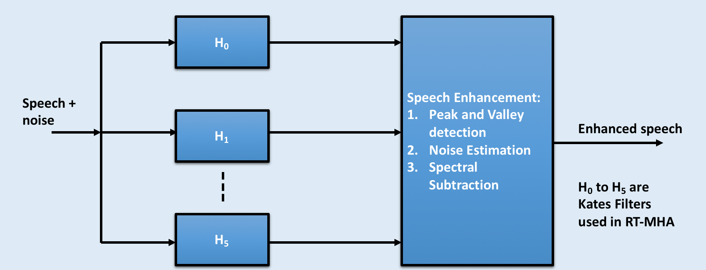

**Figure 8:** Speech Enhancement Block Diagram.

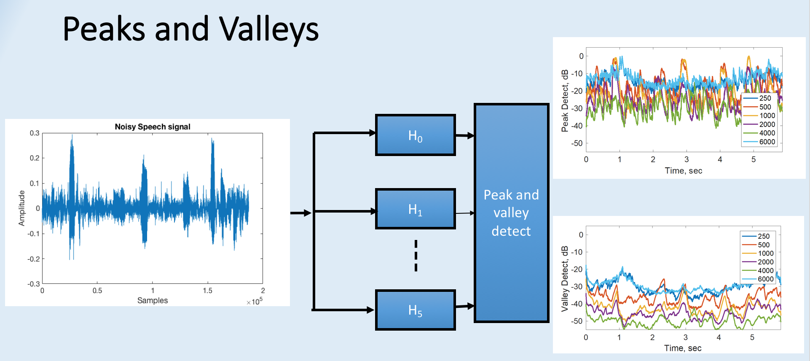

**Figure 9:** Peak and Valley detection.

**Parameters for Noise estimation Algorithms:**

Noisy speech envelope peak detection LP filter coefficients:

1. Attack time (ms) = 3
2. Release time (ms) = 50
3. Time to average the signal to prime the noise estimation (ms) = 50

Parameters for the valley detection:

1. LP attack time constant (ms) = 10
2. LP release time constant (ms) = 100

Arslan Power Averaging Procedure parameters:

1. Maximum increase (dB/sec) = 10
2. Maximum decrement (dB/sec) = -25

Hirsch & Ehrlicher weight averaging procedure parameters:

1. LP time constant in ms (tc) = 100 ms
2. Speech/noise threshold (tsn) = 2

Cohen & Berdugo MCRA Procedure parameters:

1. Threshold for P[speech] (δ)= 10

### RT-MHA Performance
In Table 1, we present performance of RT-MHA compared with 3 commercial HAs from Opticon (open sound experience – opn, Alta2, and Sensei). These are high-end, high-end and mid-level HAs, respectively, from Oticon. Based on the results, we conclude that RT-MHA performance is comparable to that of commercial HAs. 

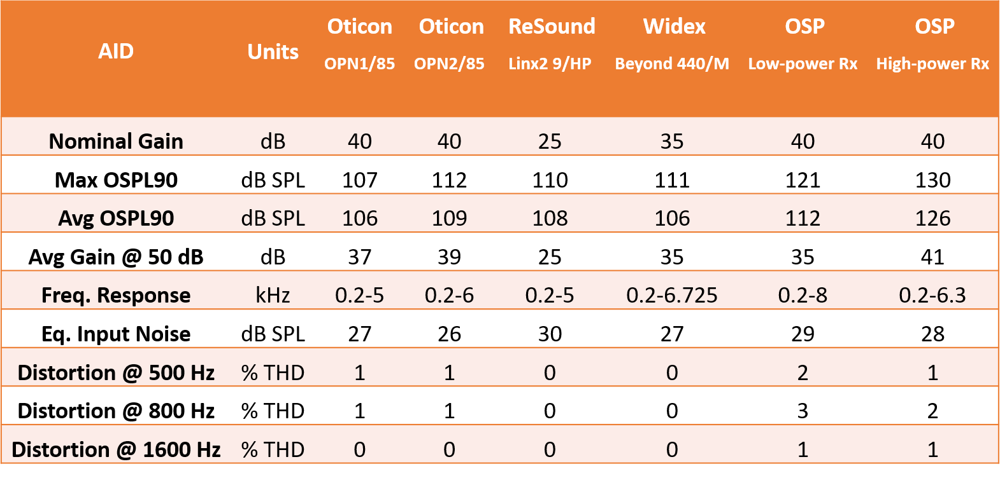
**Table 1:** Performance of RT-MHA as compared with commercial HAs.

### User Device Software
The user device software is implemented above TCP/IP layer in a software stack called OSPLayer. Figure 8 shows the runtime parameters enabled in the current implementation. Future extensions will include uploading audio and other internal states of RT-MHA to the user device for post processing. This modular structure enables investigations in self fitting and auto fitting algorithms.

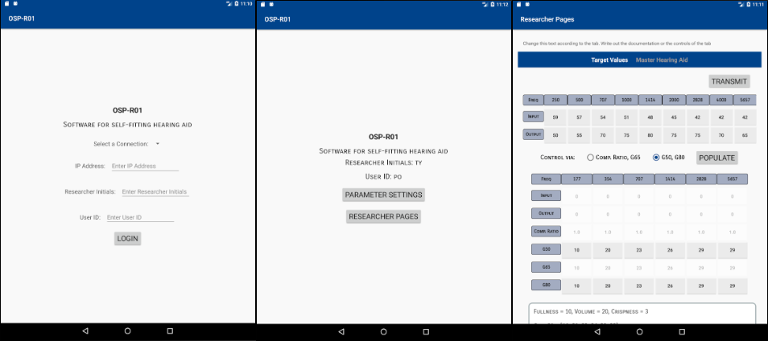

**Figure 10:** Screenshots of user device software examples: software parameters that are controllable in real time (left); self-fit software (center); word recognition test for evaluating HA performance (right).

-----

## **OSP Installation**
### Basic Installation (for use with onboard microphone and speaker)
**1. Install Xcode:** This program will be used to compile and run the RT-MHA. In the Apple app store, search for and install Xcode.

**2. Open Terminal:** Terminal is the underlying interface that allows you to run commands and programs that do not have a graphical user interface, via typing on a command line. You will need this to install several dependent programs. Open a Terminal window in Finder: Applications > Utilities > Terminal.

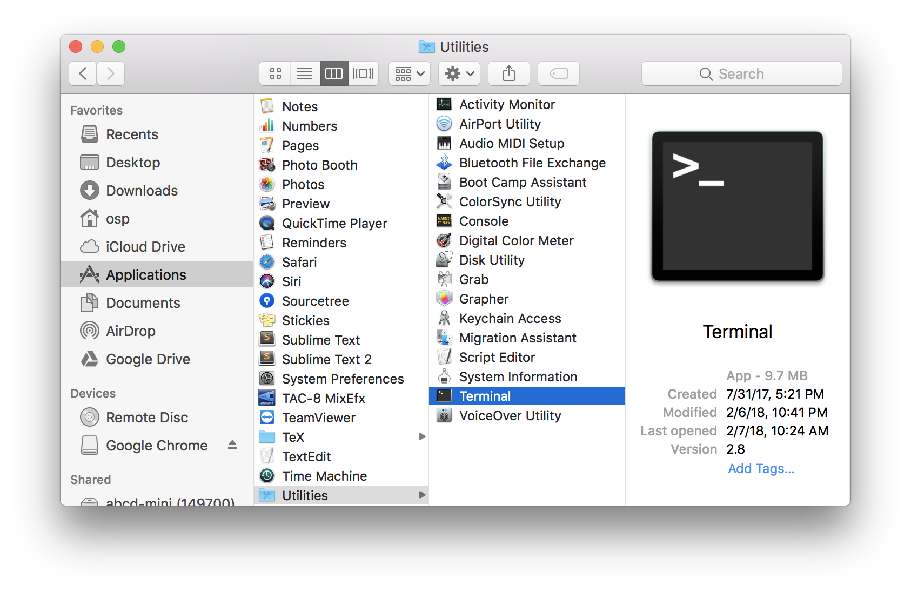

**3. Install Brew:** Brew is a package manager in which more dependent programs will be installed. In a terminal window, copy and paste the following line and press Enter on your keyboard:

    /usr/bin/ruby -e "$(curl -fsSL https://raw.githubusercontent.com/Homebrew/install/master/install)"

**4. Install dependencies with Brew:** In a terminal window, copy and paste the following lines and press Enter on your keyboard:

    brew install portaudio
    brew install doxygen
    brew install graphviz

**5. Open Audio MIDI Setup** This can be found in Finder: Applications > Utilities.

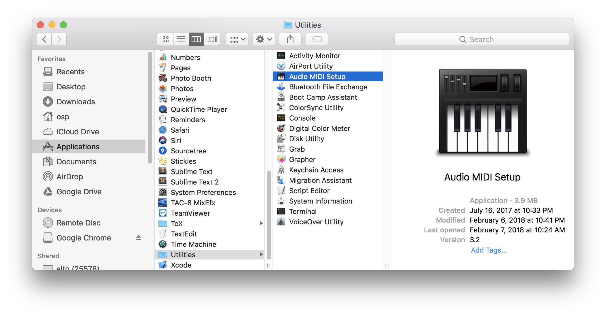

**6. Select primary input:** In Audio MIDI Setup, right-click (CTRL+click) Built-in Microphone on the left hand side. Select "Use This Device For Sound Input." 

**7. Select primary output:** In Audio MIDI Setup, right-click (CTRL+click) Built-in Output on the left hand side. Select "Use This Device For Sound Output."

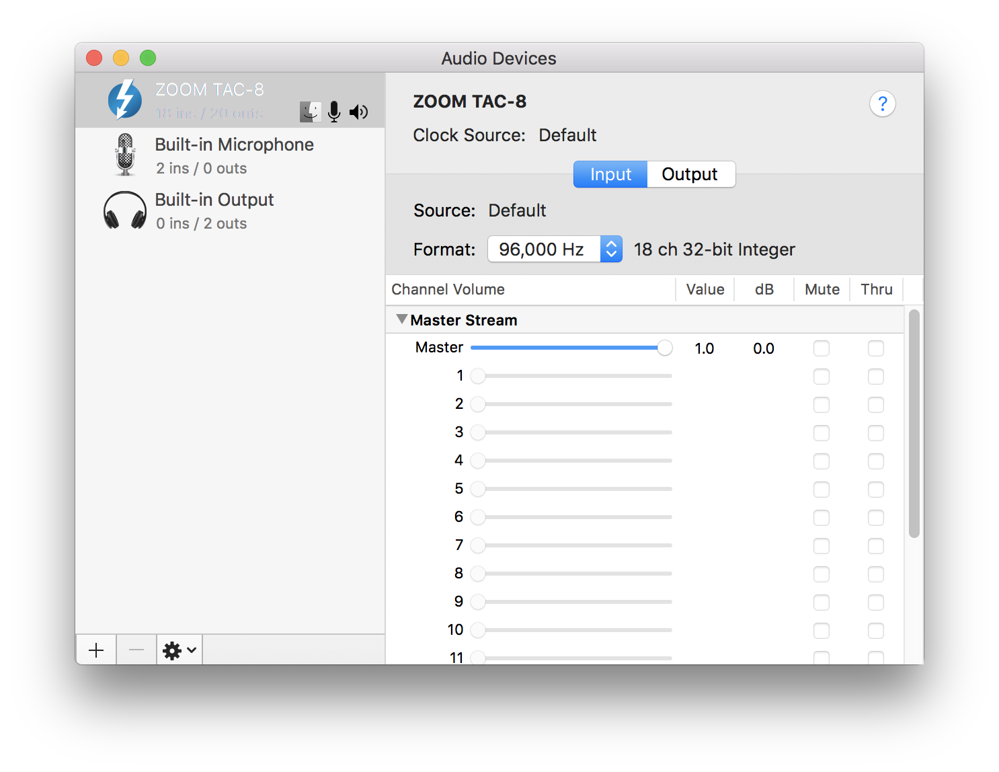

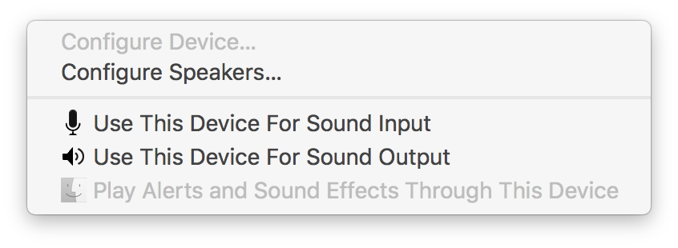

**8. Download and unzip OSP files:** Download the entire Github repository as a .zip file at the top of this website (scroll up right now!). It is usually downloaded to the Downloads folder. Double-click the .zip file, and it should extract its contents to a new folder in the same location.

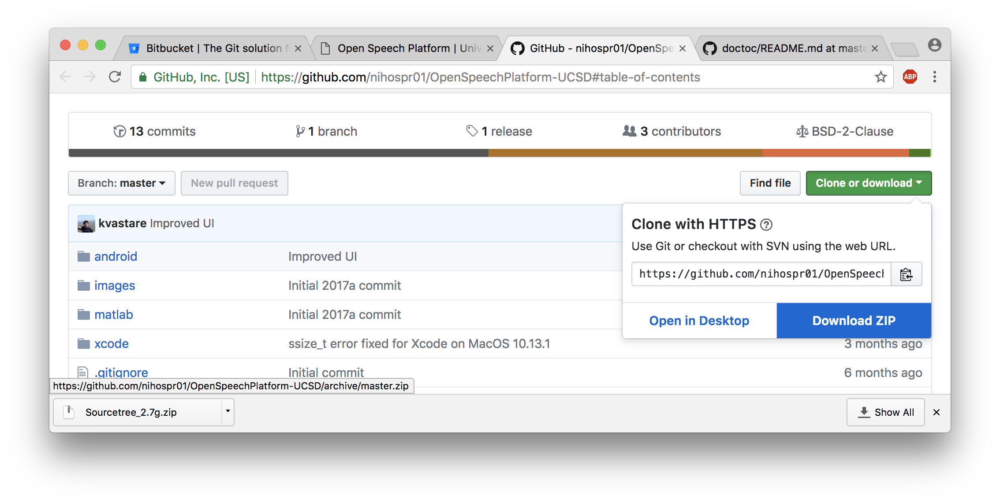

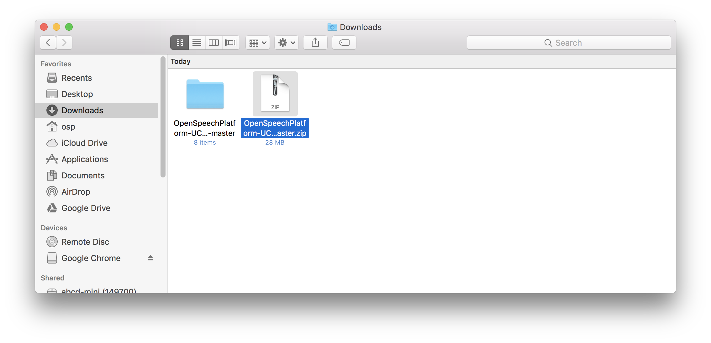

**9. Open Xcode and open the project file:** If a Welcome window appears (shown below), click "Open another project..." and navigate to the unzipped OSP folder. Otherwise, use the menu bar: File > Open. Navigate to your unzipped OSP folder: xcode > osp.xcodeproj

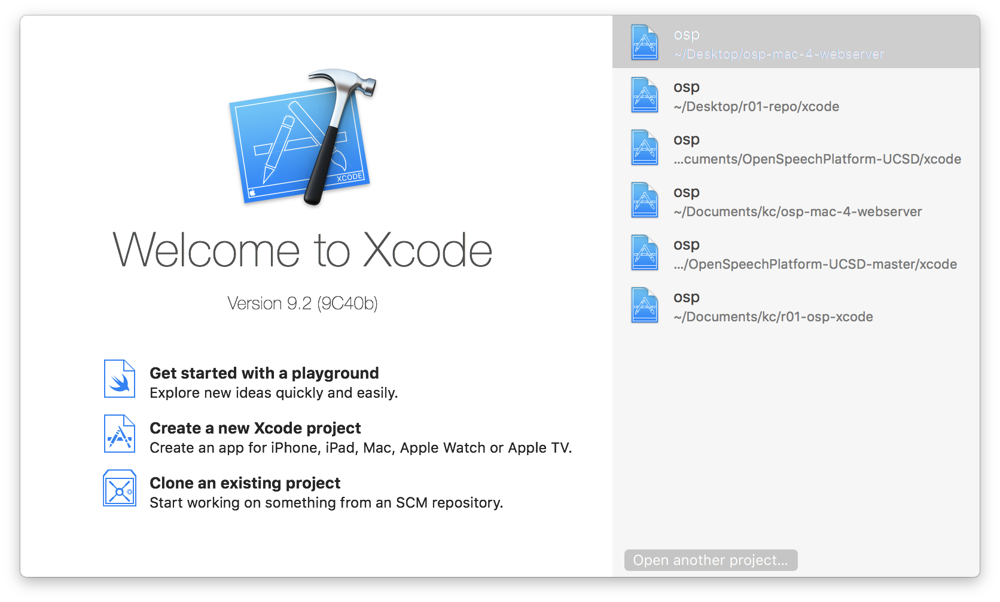

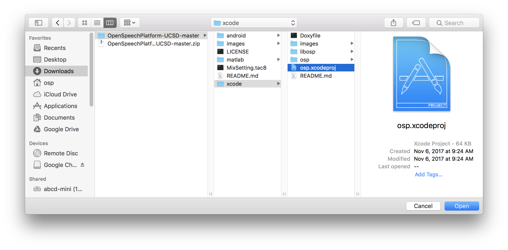

Note: If a prompt appears warning that the project was downloaded from the internet, click Open.

**10. Build and run project:** Click the Play triangle button at the top of the window.

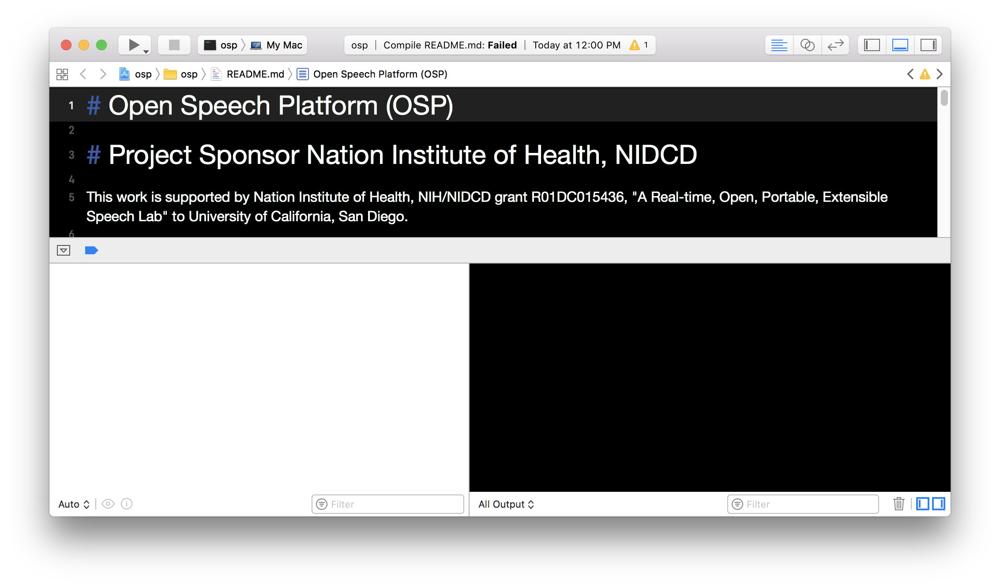

*Note: If a prompt appears asking “Enable developer mode for this Mac”, click Enable.*

*Note: To hide the sidebars on the Xcode window (as shown below), you can toggle the left and right sidebars with the buttons at the top of the window.*

**8. Test system:** Run your finger across the Macbook onboard microphone. If you can hear noise through the Macbook speaker (or headphones), the system is working correctly.

### Installation for use with Zoom TAC-8
1. Follow the Basic Installation instructions above.

2. Download the **TAC-8 drivers** and **TAC-8 MixEfx Software** from the Zoom website (you may have to scroll down to the Software section): https://www.zoom-na.com/products/production-recording/audio-interfaces/zoom-tac-8-thunderbolt-audio-converter#downloads

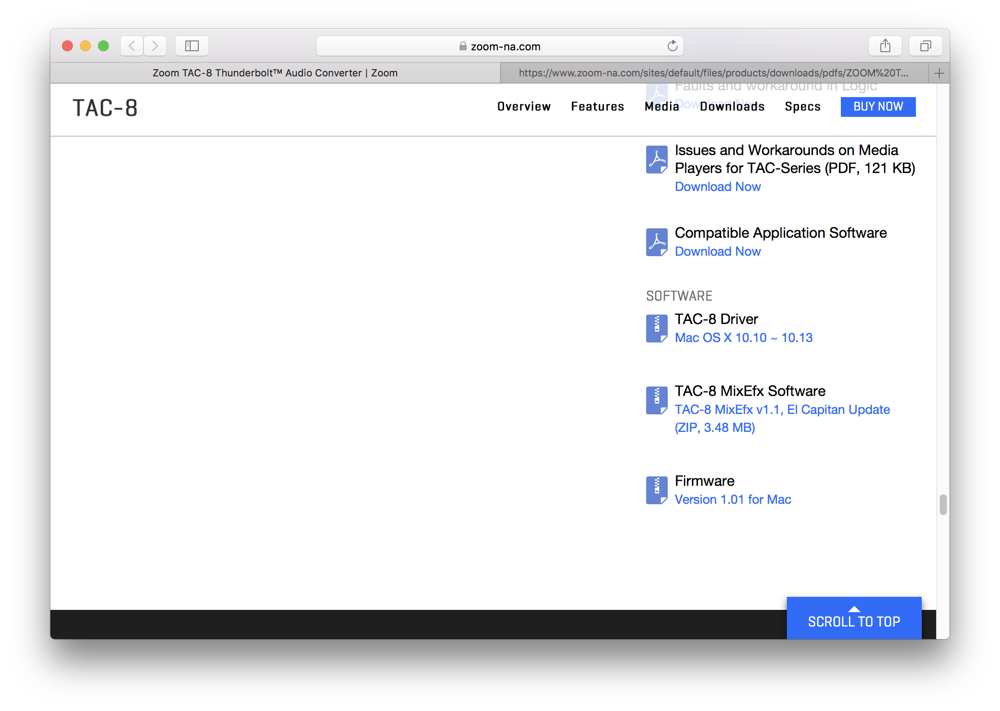

3 In your download location, open each folder and double-click the .pkg file. Follow the on-screen instructions to complete installation.

4. Restart the computer.

5. Connect the thunderbolt cable from the Zoom TAC-8 to the computer and make sure that it is switched on from the rear. If the MixEfx software does not open, open the application from the Launchpad.

6. Make sure the TAC-8 software detects the computer by powering on its lights. Otherwise, refer to the Zoom TAC-8 product page to troubleshoot the connection.

7. Load the preset MixEfx settings from the OSP folder (downloaded from the Basic Installation above). In the MixEfx menu bar: File > Open. You can find the MixSetting.tac8 file in the OSP folder. **NOTE: This needs to be done every time MixEfx is started.**

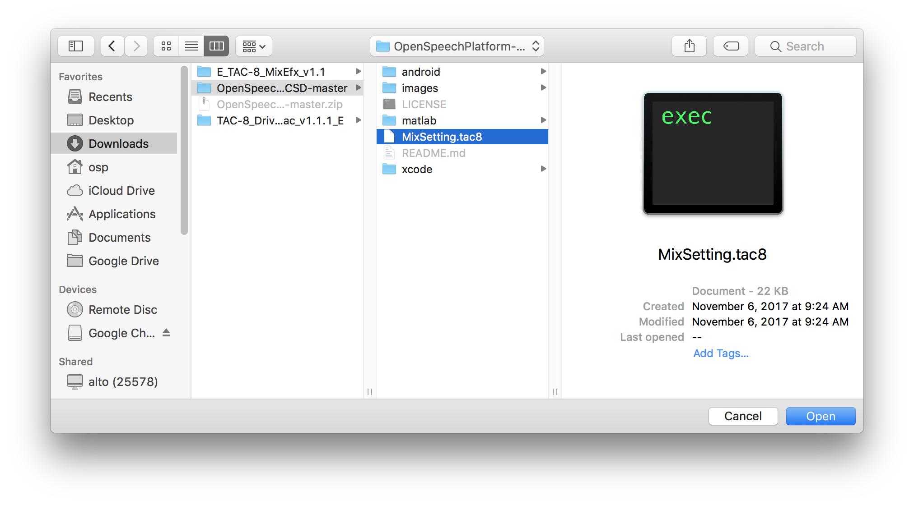

8. In Finder, open Audio MIDI Setup under Applications > Utilities.

9. In Audio MIDI Setup, left-click ZOOM TAC-8 on the left sidebar. On the right hand side, change the sampling format to 96kHz on the Input and Output tabs.

10. Right-click (CTRL+click) ZOOM TAC-8 on the left hand side. Select "Use This Device For Sound Input." Do the same for "Use This Device for Sound Output."

11. Make sure the physical input and output connections are properly made. Connect a microphone to INPUT 1 or 2, and connect appropriate speakers to OUTPUT 1 or 2. Note that in basic operation, sounds in INPUT 1 correspond to OUTPUT 1, and INPUT 2 to OUTPUT 2.

*Note: The inputs of the Zoom TAC-8 accept either unbalanced or balanced signals, but the outputs are balanced only. Be sure that you are using the appropriate signals.*

12. Run your finger across the connected microphone. If you can hear noise through the correct ZOOM TAC-8 output, the system is working correctly.

### OSP Runtime Arguments
With the OSP project open in Xcode, you can run the program with different options enabled. This is useful for trying new features or for debugging. Instead of clicking the "run" button (in the basic instructions), CTRL+click the button to open a new window, which lets you run different options by passing arguments (the hypenated letters below). OSP supports the following arguments:

- **-a** starts the application with the AFC turned off by default.

- **-r** starts the application with the rear microphones turned off by default. That is, it disables channels 3 and 4 on the Zoom Tac-8 box since they correspond to the rear left and rear right microphones on the hearing aids. If you're not using these channels, and are just using channels 1 and 2, this is recommended, although it doesn't hurt if these channels are left on (the beamforming algorithm is relatively light and doesn't take too much processing power).

- **-d<gain_value>** starts the application with a built-in gain of `<gain>`. This is mostly used to set an attenuation factor, in which case, a negative gain is supplied. If the user wants a -20dB gain (attenuation), then he will start the application with `./osp-exe -d-100` or `./osp-exe -d -100`. The space between the -d flag and the gain is ignored, so either case will work.

- **-T<AFC_type>** starts the application with a predefined AFC type. The types of AFC supported are '0' = FXLMS and '1' = PNLMS. So if the user wants to start the application with PNLMS, he will start the program with `./osp-exe -T1`. If the -T flag is not supplied, the program will default to FXLMS. It is possible to extend AFC with improved algorithms such as the sparsity promoting LMS (SLMS) [14].

- **-l<loopback_file>** starts the application in loopback-only mode. The audio is not enabled, and instead, audio data is read from `<loopback_file>` into the application where the OSP algorithm is applied to the audio data, and written to an output file. This is useful for verifying against benchmark data, such as from MATLAB. This mode is mostly used for internal debugging.

- **-t** starts the application in TCP daemon mode. In this mode, the application is waiting for a connection on port 8001 from an OSP client. Once a client is connected, all parameters (such as `-g50` and `-g80` gains, attack/release time, knee points, etc) come from the client. The command line version of the application cannot be changed manually. To stop the application once it's started in TCP mode, the user must hit CTRL+C.

- **-M<MPO_on_off>** By setting MPO to '0', MPO is disabled and attenuation factor is set to 0 dB; by setting it to '1', MPO is enabled. When MPO needs to be disabled, the following command should be executed `./osp-exe -M0`. Similarly to enable MPO, the following command needs to be executed `./osp-exe -M1`. This functionality is mainly for disabling MPO for testing the Hearing aid, for example, for performing the ANSI test we do not need MPO functionality.

- **-N<noise_estimation>** starts the application with a predefined Noise estimation algorithm. The types of Noise estimation algorithms RT-MHA supports are '1' = Arslan Power Averaging Procedure, '2' = Hirsch & Ehrlicher weight averaging procedure and  '3' = Cohen & Berdugo MCRA Procedure.

- **-S<spectral_subtraction_on_off>** By setting spectral_subtraction to '0', spectral subtraction is disabled; by setting to '1', spectral subtraction is enabled.

- **-h displays all of the above options on the command line. '-h' is short for "help" in case the operator needs a quick cheat-sheet for the command-line arguments that are supported.**

**NOTE: If the '-t' (TCP daemon mode) flag is* NOT *supplied, the application will start in keyboard-input mode**. In this mode, many parameters can be changed on-the-fly from keyboard inputs while the program is running. To change the parameters, simply enter the values below (one at a time followed by the enter key) in the same terminal the osp-exe program was run from.  

- **g <gain_value>**: If the operator chooses to adjust the gain to 10dB, he/she can simply enter 'g 10' followed by Enter on the command line. 

- **s**: If the operator wants to turn on/off AFC, he/she can simply enter 's' followed by enter to toggle AFC mode.

- **p <spectral_subtraction_parameter>** If the operator chooses to adjust the spectral subtraction to 0.5, he/she can simply enter 'p 0.5' followed by Enter on the command line. The range for spectral subtraction parameter is from 0 to 1. 

- **c** to save the converged afc filter coefficients.

- **f** to toggle feedback.

- **q** to quit the application.

### Changing filter coefficients
1.	The filter coefficients can be changed by replacing the `filterbank_coeffs*.flt` files in the following directory: r01-osp-xcode/osp/filter_coefficients
2.	By default we have set the filterback coefficients to Kates filters. You can access Boothroyd filterbanks in r01-osp-xcode/osp/Boothroyd Filters.
3.	Also you can define your own filterbanks in flt format and save them in r01-osp-xcode/osp/filter_coefficients to test them.

### Setting Up Mac's Wi-Fi
1. Wi-Fi dongle – EDUP – DB 1607
	1. Download the appropriate dongle drivers from the website: 
	http://www.szedup.com/support/driver-download/ep-db1607-driver/
	2. In Finder, navigate to your the downloaded folder (usually in Downloads)
	3. Double-click Installer.pkg
	4. Follow the on-screen instructions to complete installation.
	5. Restart the Macbook.
	6. Click the USB Wi-Fi icon in the menu bar (at the top of your screen) and connect to your preferred Wi-Fi network.
	7. On the menu bar, click the Apple icon and open System Preferences.
	8. In System Preferences, go to Sharing > Internet Sharing 
	9. In the “Share your connection from” field, select the USB dongle (in our case, the 802.11ac WLAN adapter)
	10. In the “To Computer using” field, select the Wi-Fi.
	11. Select Wi-Fi options. Change the network name for a desired (arbitrary) network name, and create a password for this network. This created network will be used to connect the tablet to the Macbook.
	12. Make sure your Mac’s Wi-Fi is turned on.
	13. On the left side column, select Internet Sharing, then and click “start” in the prompt that appears.

### Setting Up Android
1. The android app can be installed on the device in 2 ways:
	- We have included a ready-to-install apk for the R01 android app. Simply copy the .apk file from the OSP folder to an Android device and run it in the device.
    - We have also provided the Android app project in the OSP folder. You can customize and build the app, then port it to the android device using an Android IDE.

### Working with the Android Application
1. Run the code with `–t` parameter enabled. 
2. Connect the android device to the Wi-Fi network that you defined while installing the Wi-Fi dongle.
3. The app should auto-fill the IP address of the Mac, if it fails enter: ”192.168.2.1”.
4. Enter the Researcher initials and the User initials.
5. Change the parameters in the researcher page.
6. Click transmit, the values would be loaded to the Mac. 
7. The logs would be created in the same project folder.

- Changing the location of logs

	1. Open the Xcode project.
	2. Go to Product > Scheme > Edit Scheme
	3. Under Environment Variables, edit the LOG_PATH variable to change the location of the logs directory.

*NOTE: Default log directory is the project path itself.*

- Format of log files

	Raw data from android app has the following format: 
	[date, pageName, ButtonName, CrispnessMultipliers, FullnessStepSize, VolumeStepSize, CrispnessStepSize, FullnessLevel, VolumeLevel, CrispnessLevel, FullnessValue, VolumeValue, CrispnessValue, CompressionRatio, g50, g65, g80, KneeLow, MPOLimit, AttackTime, ReleaseTime]

### OSP - Jelly beans and BoB

This section describes the use of Jelly beans JBv5 and Breakout Board (BoB v5)

#### Jelly Beans

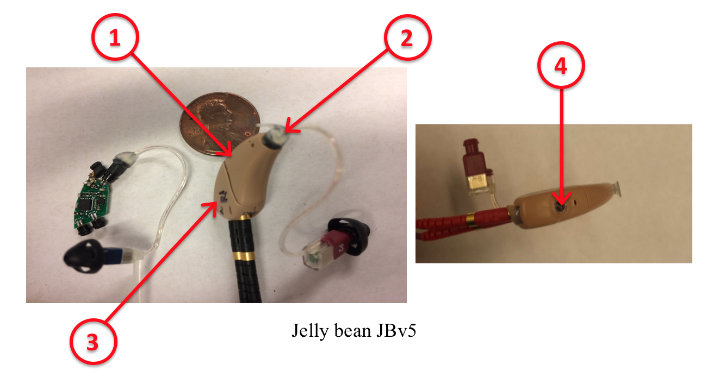

1. The jellybean shell has been sealed with hot glue. Do not attempted to open it. 102 is the serial number of this JB.
2. Standard CS44 connector. Feel free to use different receivers. All jellybeans work with left and right receivers.
3. 2x CS44 cable to the BOB. The cables are labelled 1 and 2, and should be Connected to ports 1 and 2 labelled on the JB shell. Cable 1 is always closer to the receiver.
4. Correctly connecting the cables and applying power will result in a green light visible in this port.

#### CS44 Cables

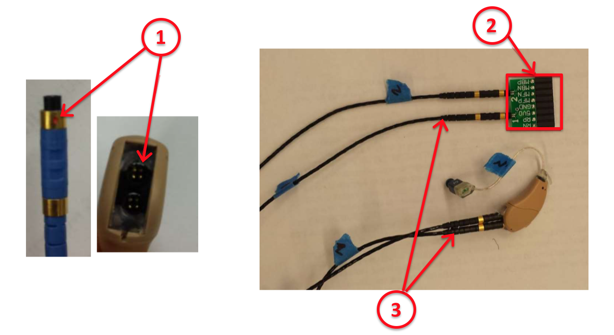

1. The red dot on the cable should line up with the white stripe on the connector in the JBv5.
2. This CS44 adapter is necessary to connect to the BoB. The 1 and 2 on the adapter should match the 1 and 2 on the BoB.
3. Cables are reversible, but it is strongly recommended that BoB-end be left secured. The cables are 1 meter long.

#### Breakout Board

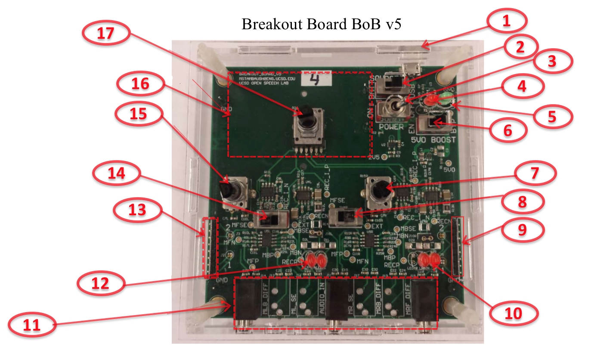

1. **USB B-Micro** : Takes a standard USB supply of 5V as an alternative to battery power. If using battery power, DISCONNECT THE USB CABLE. 
2. **Power source selector** : Switch to the left for battery power, to the right for USB power. Use a USB source from the Verifit or a computer, NOT from a 2-prong wall-outlet-adapter. EIN from a floating-ground USB source can be substantial (45dB+).
3. **Power switch** : Left for ON, right for OFF.
4. **Low Battery LED**: This LED will turn on (RED) if the battery voltage drops below 3V. The bottom side of the box must be removed to replace the batteries (3xAAA). 
5. **Power on LED** : This LED will turn on (GREEN) if power is supplied to the board. If using battery power, the LED will turn OFF in the case of low battery, and the RED led will turn on.
6. **Boost enable/bypass**: Left for ENABLE, Right for BYPASS. Bypass should only be used if an extremely sensitive digital measurement is occurring in battery mode. The switching effect of the boost regulator is not audible in normal operation.
7. **Right volume adjust** : Logarithmic potentiometer, clockwise to increase volume. This knob does NOT affect the gain of the microphone
signal coming from the JB.
8. **Right loopback selector** : Left for INTERNAL loopback (fully analog, front mic only). Right for EXTERNAL loopback (via ZT8 + DSP software).
9. **CS44 adapter to Right JB** : #1 towards the front of the device. #2 towards the back. Match with marks on the adapter PCB.
10. **Right output limiting LEDs**: Will turn on as output voltage becomes dangerously high. Can be disabled.
11. **3x TRS jack to ZT8** : See next page.
12. **Left output limiting LEDs**: Will turn on as output voltage becomes dangerously high. Can be disabled.
13. **CS44 adapter to Left JB** : #1 towards the front of the device. #2 towards the back. Match with marks on the adapter PCB.
14. **Left loopback selector** : Left for INTERNAL loopback (fully analog, front mic only). Right for EXTERNAL loopback (via ZT8 + DSP software). 
15. **Left volume adjust** : Logarithmic potentiometer, clockwise to increase volume. This knob does NOT affect the gain of the microphone signal coming from the JB.
16. **Battery pack** : Takes 3 standard AA alkaline cells.
17. **Stereo volume adjust**: Logarithmic potentiometer, clockwise to increase volume. This knob adjusts the output level of both JB equally.

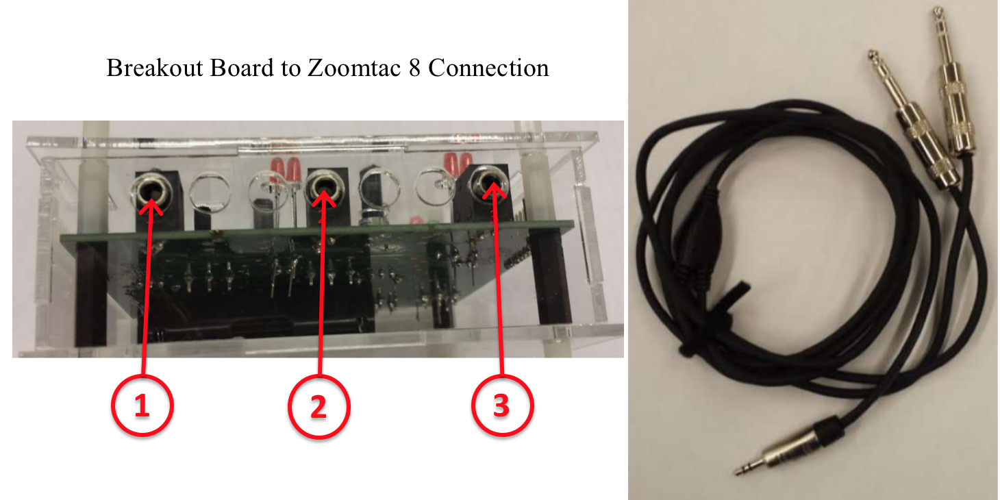

1. Left Front Mic differential output
2. Left and Right Receiver single-ended inputs 
3. Right Front Mic differential output

All outputs are 0V DC biased.

This is the only audio cable provided with the OSP hardware. It converts the dual-channel differential output from the ZT8 to stereo single-ended for the BoB.

#### Startup Procedure

Switches 2, 6, 8, and 14 will require a pen or other aid to switch with the box assembled. This is by design to prevent accidental switching of operating modes during experiments.

For each ear:

1. Connect Jellybean to BoB with the CS44 cables and connectors 9 (right) or 13 (left) on the BoB.
2. Use Switch 8 (right) or 14 (left) on the BoB to enable Internal loopback mode.
3. Use Switch 2 to select the power source for the BoB. If using USB, only use a PC or other grounded device as the source. A 2-prong wall adapter is NOT sufficient. If using batteries, enable Boost with switch 6 (see page 5).
4. Turn on the power to the BoB (switch 3). A green light should be visible in the Jellybean.
5. Turn knobs 7 (right) and 15 (left) on the BoB clockwise to increase individual channel output. Knob 17 adjusts both channels equally. With a receiver in place and maximum volume the Jellybean should feedback audibly (low-power receivers may not feedback until a hand is cupped nearby). The absence of audible feedback suggests an error in system assembly.
6. Place Jellybean and receiver in Verifit or other calibration device.
7. Using a pink noise or ANSI 3.22 as a guide, adjust the output volume with knobs , 15, or 17 on the BoB until the desired gain is achieved. 40-42dB gain is typical before acoustic feedback occurs in internal mode.
8. Use Switch 8 or 14 to engage External mode. Connect the BoB to ZoomTac or other audio interface using 3.5mm TRS cables (See page 6 for connector functions).
9. Adjust input gain on ZoomTac (or equivalent) to maximize dynamic input range to the ADC.
10. Run the OSP software and attenuate as desired within the program.

#### Troubleshooting

If no sound is coming out of the receiver, check the following:

1. Is the BoB’s “Power on” (green) LED on? If not, check switches 3 (power) and 2 (source select).

2. Is the JB’s “Power on” (green) LED on? If not, check the CS44 cable connections. Verify that cables 1 and 2 are in the correct sockets on both JB and BoB. Verify that the adapter board is not in backwards.

3. Check switch 8 or 14. Is the BoB in the correct mode for this test (Internal or External)? If External mode is desired, verify the proper cable connection to ZT8 (or equivalent).

4. Check knobs 7 or 15. In the fully-counterclockwise position they will cut off output completely.

5. Is the receiver properly seated in the Jellybean?

#### Single Ear Signal Path

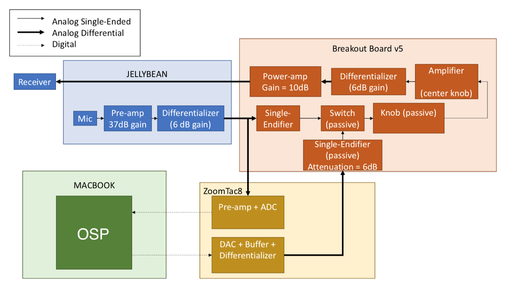

### MATLAB Documentation
The following files have been included with R01 OSP-MATLAB release:

1.	Filterbank Coefficients: Boothroyd Filters and Kates filter banks have been included in this folder as .flt files. MHA_GenerateFbank.m is the MATLAB function to produce the filterbanks.

2.	MHA parameters: This folder contains the MHA parameters for 4 different standard audiograms: NH, N2, N4, and S2. NH is normal hearing and N2, N4, and S2 are 3 types of hearing losses. In each file, there are 7 columns, each with 6 numbers:

	- Column 1: hearing losses of the 6 bands.
	- Column 2: gain values at 50 dB SPL for the 6 bands.
	- Column 3: gain values at 80 dB SPL for the 6 bands.
	- Column 4: attack times for the 6 bands.
	- Column 5: release times for the 6 bands.
	- Column 6: lower kneepoints for the 6 bands.
	- Column 7: upper kneepoints for the 6 bands.
	
3.	Feedback Paths: 26 feedback paths provided from Prof. James Kates of University of Colorado Boulder have been included. The feedback path impulse responses were recorded using real hearing aid devices put on an “EDDI” acoustic manikin. The sampling frequency was 15.625 kHz. Each feedback path was measured from a particular scenario and can be identified by its file name:

	- Earmold: 0=leaky unvented, 1=tight fit unvented, 2=vented
	- Handset: 0=on ear, 1-5=cm separation, 6=removed
	- For example,  EDDI26.DAT means “vented” with “handset removed”; EDDI0.DAT means “leaky unvented” with “handset on ear”.

4.	HASPI_HASQI: The HASPI and HASQI are performance metrics to measure the intelligibility and quality of audio files, respectively. HASPI and HASQI codes have been provided to us from Prof. James Kates. The Description of using the functions have been documented in the functions themselves. The files haspi_v1.m and hasqi_v2.m are functions to evaluate the speech files.

5.	Input Files: All the input sound files are 32kHz sampled. Add your custom input files at that sampling rate in the same folder.

## **API**

[Click Here for Open Speech Platform API](http://openspeechplatform.ucsd.edu/doxygen/osp__process_8c.html)

## **License**
Copyright 2017  Regents of the University of California

Redistribution and use in source and binary forms, with or without modification, are permitted provided that the following conditions are met:

1. Redistributions of source code must retain the above copyright notice, this list of conditions and the following disclaimer.

2. Redistributions in binary form must reproduce the above copyright notice, this list of conditions and the following disclaimer in the documentation and/or other materials provided with the distribution.

THIS SOFTWARE IS PROVIDED BY THE COPYRIGHT HOLDERS AND CONTRIBUTORS "AS IS" AND ANY EXPRESS OR IMPLIED WARRANTIES, INCLUDING, BUT NOT LIMITED TO, THE IMPLIED WARRANTIES OF MERCHANTABILITY AND FITNESS FOR A PARTICULAR PURPOSE ARE DISCLAIMED. IN NO EVENT SHALL THE COPYRIGHT HOLDER OR CONTRIBUTORS BE LIABLE FOR ANY DIRECT, INDIRECT, INCIDENTAL, SPECIAL, EXEMPLARY, OR CONSEQUENTIAL DAMAGES (INCLUDING, BUT NOT LIMITED TO, PROCUREMENT OF SUBSTITUTE GOODS OR SERVICES; LOSS OF USE, DATA, OR PROFITS; OR BUSINESS INTERRUPTION) HOWEVER CAUSED AND ON ANY THEORY OF LIABILITY, WHETHER IN CONTRACT, STRICT LIABILITY, OR TORT (INCLUDING NEGLIGENCE OR OTHERWISE) ARISING IN ANY WAY OUT OF THE USE OF THIS SOFTWARE, EVEN IF ADVISED OF THE POSSIBILITY OF SUCH DAMAGE.

## **References**

1. Harinath Garudadri, Arthur Boothroyd, Ching-Hua Lee, Swaroop Gadiyaram, Justyn Bell, Dhiman Sengupta, Sean Hamilton, Krishna Chaithanya Vastare, Rajesh Gupta, and Bhaskar D. Rao, "A Realtime, Open-Source Speech-Processing Platform for Research in Hearing Loss Compensation", In Signals, Systems and Computers, 2017 51st Asilomar Conference, IEEE, 2017.

2. James M. Kates, "Principles of digital dynamic-range compression," Trends in Amplification, vol. 9, no.2, pp. 45-76, 2005.

3. Shilpi Banerjee, The compression handbook: An overview of the characteristics and applications of compression amplification, 4th Edition, Starkey Laboratories, 2017.

4. James M. Kates, Digital hearing aids, Plural publishing, 2008.

5. Toon van Waterschoot and Marc Moonen, "Fifty years of acoustic feedback control: State of the art and future challenges," Proceedings of IEEE, vol. 99, no. 2, pp. 288-327, 2011.

6. Johan Hellgren, "Analysis of feedback cancellation in hearing aids with Filtered-x LMS and the direct method of closed loop identification," IEEE Transactions on Speech and Audio Processing, vol. 10, no. 2, pp. 119-131, 2002.

7. Hsiang-Feng Chi, Shawn X. Gao, Sigfrid D. Soli, and Abeer Alwan, "Band-limited feedback cancellation with a modified filtered-X LMS algorithm for hearing aids," Speech Communication, vol. 39, no. 1-2, pp. 147-161, 2003.

8. Donald L. Duttweiler, "Proportionate normalized least-mean-squares adaptation in echo cancelers," IEEE Transactions on Speech and Audio Processing, vol. 8, no. 5, pp. 508-518, 2000.

9. Jacob Benesty and Steven L. Gay, “An improved PNLMS algorithm,” in Proceedings of IEEE International Conference on Acoustic, Speech, and Signal Processing (ICASSP), pp. 1881-1884, 2002.

10. Constantin Paleologu, Jacob Benesty, and Silviu Ciochină, "An improved proportionate NLMS algorithm based on the l0 norm," in Proceedings of IEEE International Conference on Acoustic, Speech, and Signal Processing (ICASSP), pp. 309-312, 2010.

11. Arslan, Levent, Alan McCree, and Vishu Viswanathan. "New methods for adaptive noise suppression." Acoustics, Speech, and Signal Processing, 1995. ICASSP-95., 1995 International Conference on. Vol. 1. IEEE, 1995.

12. Hirsch, Hans-Günter, and Christoph Ehrlicher. "Noise estimation techniques for robust speech recognition." Acoustics, Speech, and Signal Processing, 1995. ICASSP-95., 1995 International Conference on. Vol. 1. IEEE, 1995.

13. Cohen, Israel, and Baruch Berdugo. "Noise estimation by minima controlled recursive averaging for robust speech enhancement." IEEE signal processing letters 9.1 (2002): 12-15.

14. Lee, Ching-Hua, Bhaskar D. Rao, and Harinath Garudadri. "Sparsity promoting LMS for adaptive feedback cancellation". In Signal Processing Conference (EUSIPCO), 2017 25th European, pp. 226-230. IEEE, 2017.

