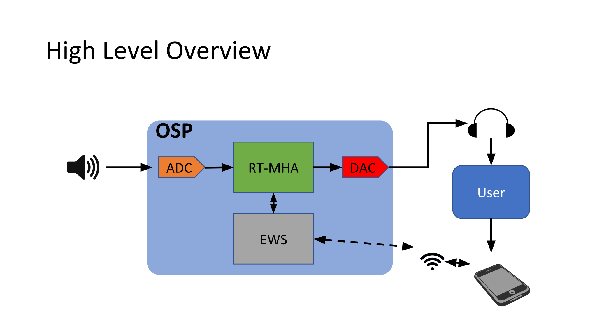
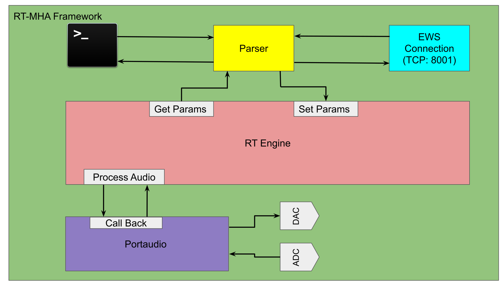
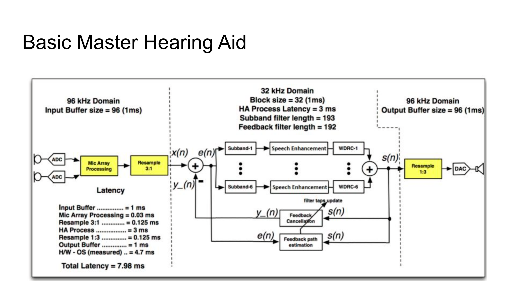
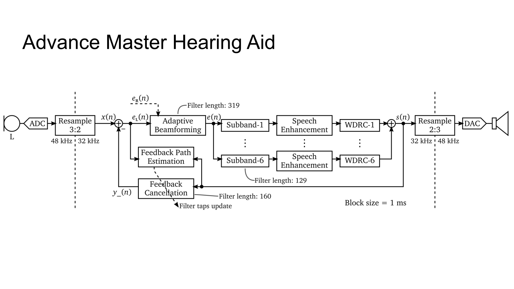
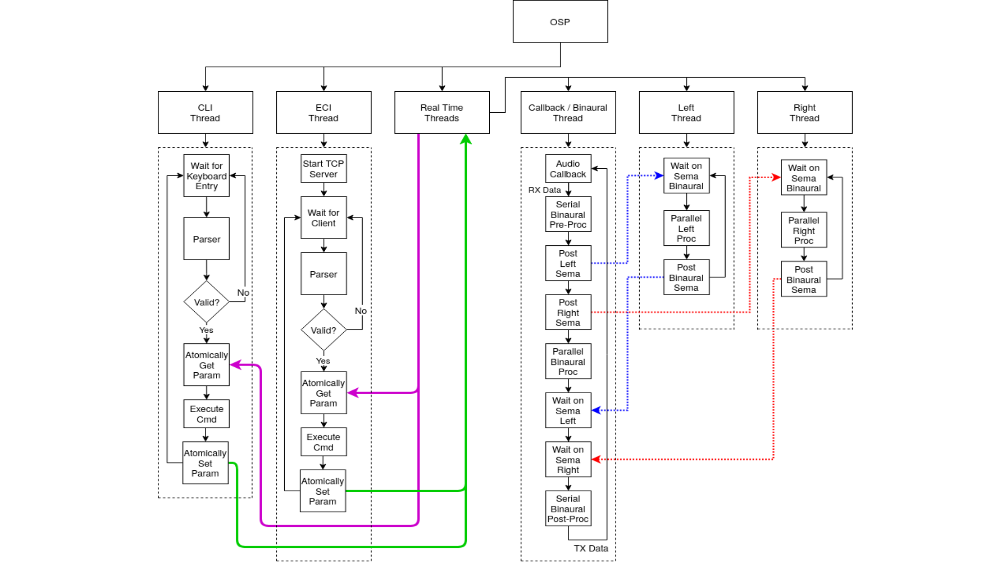

# OSP Documentation

This describes how the RT-MHA (osp) process
works.  It will not go into details about the algorithms.

## Building

### Requirements

The following Debian/Ubuntu packages must be installed
* cmake
* portaudio19-dev
  
### Compiling

`make` or `make release` builds an optimized binary.

The binaries will be built in the `release` or `debug` directory.  

The default installation directory is `../release` or `../debug`

You can set a different installation directory by setting the `PREFIX`
environment variable. You will need to run using `sudo` if you install
into a system directory.

```
/opt/osp/libosp (develop)> sudo PREFIX=/usr/local make release
```

### Running

You must first set the environment variable `OSP_MEDIA` before running osp.

```
/opt2/OSP/libosp-dev > export OSP_MEDIA=/opt/osp/ewsnodejs-server/src/utils/audio
/opt2/OSP/libosp-dev > ./release/src/osp
OSP (RT-MHA) Version 0.9-9-g57eeead
New process started at PID 83145
ALSA lib pcm_dsnoop.c:641:(snd_pcm_dsnoop_open) unable to open slave
ALSA lib pcm_dmix.c:1089:(snd_pcm_dmix_open) unable to open slave
ALSA lib pcm.c:2642:(snd_pcm_open_noupdate) Unknown PCM cards.pcm.rear
ALSA lib pcm.c:2642:(snd_pcm_open_noupdate) Unknown PCM cards.pcm.center_lfe
ALSA lib pcm.c:2642:(snd_pcm_open_noupdate) Unknown PCM cards.pcm.side
ALSA lib pcm_oss.c:377:(_snd_pcm_oss_open) Unknown field port
ALSA lib pcm_oss.c:377:(_snd_pcm_oss_open) Unknown field port
ALSA lib pcm_usb_stream.c:486:(_snd_pcm_usb_stream_open) Invalid type for card
ALSA lib pcm_usb_stream.c:486:(_snd_pcm_usb_stream_open) Invalid type for card
ALSA lib pcm_dmix.c:1089:(snd_pcm_dmix_open) unable to open slave
Input latency: 0.002
Output latency: 0.003
ALSA lib pcm.c:8526:(snd_pcm_recover) underrun occurred
ALSA lib pcm.c:8526:(snd_pcm_recover) underrun occurred
Expression 'err' failed in 'src/hostapi/alsa/pa_linux_alsa.c', line: 3355
Expression 'ContinuePoll( self, StreamDirection_In, &pollTimeout, &pollCapture )' failed in 'src/hostapi/alsa/pa_linux_alsa.c', line: 3896
Expression 'PaAlsaStream_WaitForFrames( stream, &framesAvail, &xrun )' failed in 'src/hostapi/alsa/pa_linux_alsa.c', line: 4274
10
Stream failed.  Retrying...
Input latency: 0.002
Output latency: 0.003
ALSA lib pcm.c:8526:(snd_pcm_recover) underrun occurred
ALSA lib pcm.c:8526:(snd_pcm_recover) underrun occurred
ALSA lib pcm.c:8526:(snd_pcm_recover) underrun occurred
ALSA lib pcm.c:8526:(snd_pcm_recover) underrun occurred
2996
2990
OSP RUNNING
```

Notice the errors starting with "Expression".  These internal portaudio/alsa errors
have proven to be difficult to prevent.  As a workaround, the audio startup code will
keep trying until it gets a stable connection.  `OSP RUNNING` is printed when it is finished.

### osp_cli

The `osp_cli` program provide a convenient way to monitor, interact with, or test `osp`.
It is installed as `osp_cli` and is also runnable as `libosp/bin/osp_cli.py`.


[](images/osp_cli.png)  
\image html images/osp_cli.png width=80%

## Architecture

[](images/HighLevel.png)  
\image html images/HighLevel.png width=80%


This document describes the green box in the image above.
Inside the green box, we have the following.
[](images/Framework.png)  
\image html images/Framework.png width=80%


The osp process
initializes the audio inputs and outputs and sets up the audio pipeline
so that incoming audio packets are sent to the various audio processing
algorithms.  It also parses the incoming requests from the EWS (Embedded Web Server) and sets or gets algorithm parameters as requested.  

The RT-MHA engine algorithms are implemented in `libosp/OSP`.

### Startup


## Parameters

Name | Default | Description
---|---|---
alpha|0.0|The mixer of virtual sound (file playback) and actual sound (from the mics) where 0 is complete actual sound and 1 is complete virtual sound
en_ha|1|Enable hearing aid algorithm. 0=off, 1=on
gain|-20.0|The gain in dB
global_mpo|120.0|Set the global mpo limit

### AFC (Adaptive Feedback Cancellation)
Name | Default | Description
---|---|---
afc|1|Enable Adaptive Feedback Cancellation. 0=off, 1=on
afc_delay|4.6875|Loopback delay in millisecond to adjust for device to device variation in feedback path.
afc_mu|0.005|Adjust the step size for feedback management
afc_reset|0|Reset the taps of AFC filter to default values. A signal, not a state!
afc_rho|0.985|Adjust the forgetting factor for feedback management
afc_type|3| Adaptation type for AFC. 0: Stop adaptation, 1: FXLMS, 2: IPNLMS, 3: SLMS

### Audio Playback and Recording
Name | Default | Description
---|---|---
audio_filename|""|Audio file to play
audio_play|0|1=Play audio, 0=stop.
audio_repeat|0|Repeat the audio file

Recording is currently being reviewed.

### Beamforming
Name | Default | Description
---|---|---
amc_forgetting_factor|0.8|Adjust the forgetting factor of the power estimate for GSC beamforming [0-1]  
amc_thr|2.0|Adjust the threshold of the AMC for GSC beamforming [0 to 10]
bf|0|Enable Beamformer. 0=off, 1=on
bf_alpha|0.0| A number between -1 to 1 for different degrees of sparsity in IPNLMS-l_0
bf_amc_on_off|0|Enable adaptation mode control beamformer. 0=off, 1=on
bf_beta|150.0|A number between 0 to 500 for different degrees of sparsity in IPNLMS-l_0
bf_c|0.001|A small positive number for preventing stagnation in SLMS
bf_delta|1e-6| A small positive number to prevent dividing zero
bf_mu|0.01|Adjust the step size for GSC beamforming (Help has wrong default)
bf_nc_on_off|0| Enable norm-constrained beamformer: 0=off, 1=on
bf_p|1.3|A number between 1.0 to 2.0 for fitting different degrees of sparsity in SLMS
bf_rho|0.985|Adjust the forgetting factor for beamforming [0-1]
bf_type|3|Adaptation type for GSC beamforming. 0: Stop adaptation, 1: Modified LMS, 2: IPNLMS, 3: SLMS
nc_thr|1.0|Adjust the threshold of the norm-constrained adaptation for GSC beamforming 

### Beamforming Constants

These may be set in the default config file for osp, but cannot be modified after
osp is started.  
Name | Default | Description
---|---|---
bf_fir_length|319| The number of filter taps of adaptive filter in beamformer
bf_power_estimate|0.0|Adjust the power estimate for beamforming [remove.  make constant 0]
bf_delay_len|160|The length of delay line in samples for beamformer

### Freping

Name | Default | Description
---|---|---
freping|0|Enable freping: 0=off, 1=on
freping_alpha [num_bands]| 0.0 | Set the alpha parameter for freping [-0.02 to 0.02 ]

### Wide Dynamic Range Compression (WDRC)
Name | Default | Description
---|---|---
attack [num_bands]|5.0|Set the attack time for WDRC for the bands
g50 [num_bands]|0.0|Set the gain values at 50 dB SPL input level
g80 [num_bands]|0.0|Set the gain values at 80 dB SPL input level
knee_low [num_bands]|45.0|Set the lower knee points for the bands
mpo_band [num_bands]|120.0|Set the MPO (upper knee points) for the bands
release [num_bands]|20.0|Set the release time for WDRC for the bands


### Speech Enhancement
Name | Default | Description
---|---|---
noise_estimation_type|0|Noise Estimation type: 0=Disable; 1=Arslan; 2=Hirsch and Ehrlicher; 3=Cohen and Berdugo
spectral_subtraction|0.0|Amount to subtract between range: [0,1)
spectral_type|0|Enable spectral subtraction: 0=Disable, 1=Enable

### Misc
Name | Default | Description
---|---|---
aligned|1|Enable 10-band filterbank alignment. Aligns the delays in each subband.
num_bands|6| 6 or 10 band
audio|1| Enable audio output. 0=off.

---

### Command Line Options

```
> ./release/src/osp -h
OSP (RT-MHA) Version 0.9-9-g57eeead

 Usage: ./release/src/osp [OPTIONS]
  Options:
   -c --conf_file filename   Read configuration from the file
   -l --log_file  filename   Write logs to the file
   -d --daemon               Daemonize this application
   -p --pid_file  filename   PID file used by daemonized app
   -i --input_device num     input device number
   -o --output_device num    output device number
   -I --input_channels num   number of input channels
   -O --output_channels num  number of output channels
   -m --multithreaded bool   multithreaded
```

The `-c` option allows for setting the initial state of the system.  

`-d` runs osp in the background, detached from any terminal.  You should use `-l` with it to specify a file for the output.  

    NOTE: multithreaded mode on x86-64 Linux has audio glitches. Not recommended at this time.

---

[](images/Basic.png)  
\image html images/Basic.png width=80%

[](images/Advanced.png)  
\image html images/Advanced.png width=80%

[](images/Threads.png)  
\image html images/Threads.png width=80%


Currently, the thread priorities are set in several places.  

osp_process() sets SCHED_FIFO and the current priority level. *Update: this has been removed*

Then openspeechplatform() starts the console thread with that scheduler and priority.  *Update: it now uses the default priority*

Then it starts the EWS thread, also at that priority.

Then it sets the scheduler to FIFO and sets a new priority. And calls portaudio_wrapper() which calls PaAlsa_EnableRealtimeScheduling() (which does not seem to have any effect) and starts some audio threads (named "threaded-ml").


[](images/401c.png)  
\image html images/401c.png width=80%

CPU affinity on the 410c is very simple.  The OS and non-realtime tasks are set to use CPU 0 and the realtime audio runs on CPUs 1-3.  It may be necessary to modify this if additional load is placed on CPU 0 (such as streaming video or other high-bancwidth information).

For other hardware, the current CPU affinity code is not as appropriate.  Maybe some redesign is necessary here to accomodate other architectures.  For example, in hyperthreaded (SMT) CPUs, cpus 0 and 1 are the same physical core, as are cpus 2 and 3.  Testing indicates that the osp process runs more reliably if hyperthreading is disabled or affinity is set to not use the same physical cores.


