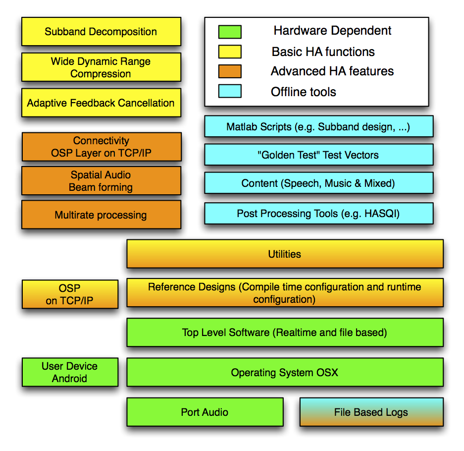
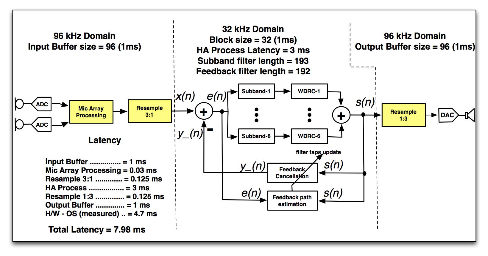
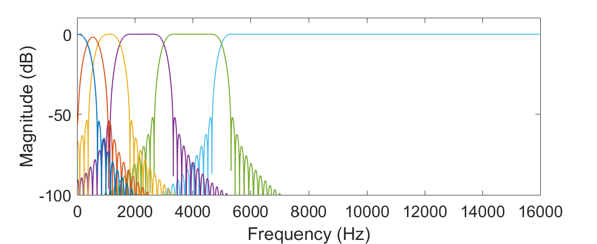
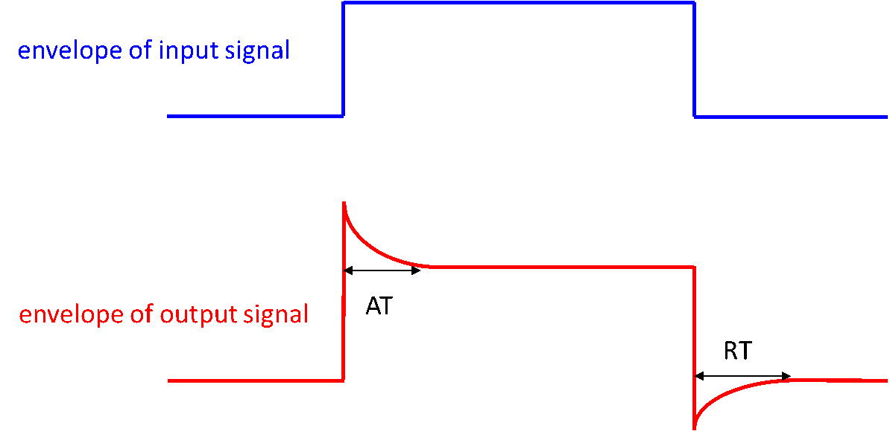
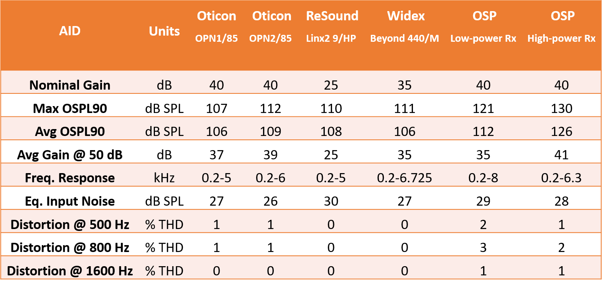

# Open Speech Platform (OSP)

# Project Sponsor Nation Institute of Health, NIDCD

This work is supported by Nation Institute of Health, NIH/NIDCD grant R01DC015436, "A Real-time, Open, Portable, Extensible Speech Lab" to University of California, San Diego.

<!-- START doctoc generated TOC please keep comment here to allow auto update -->
<!-- DON'T EDIT THIS SECTION, INSTEAD RE-RUN doctoc TO UPDATE -->

# Table of Contents

- [License](#license)
- [Overview](#overview)
  - [Summary](#summary)
  - [Recommended Usage](#recommended-usage)
    - [For Electrical Engineering and Computer Science Practitioners](#for-electrical-engineering-and-computer-science-practitioners)
    - [For Audiologists and Speech Scientists](#for-audiologists-and-speech-scientists)
  - [Real-Time Master Hearing Aid (RT-MHA) Software](#real-time-master-hearing-aid-rt-mha-software)
    - [Subband decomposition](#subband-decomposition)
    - [WDRC](#wdrc)
    - [AFC](#afc)
    - [RT-MHA Performance](#rt-mha-performance)
  - [User Device Software](#user-device-software)
- [OSP Installation](#osp-installation)
  - [Basic Installation](#basic-installation)
  - [(Optional) Zoom TAC-8 Installation for Use with OSP](#optional-zoom-tac-8-installation-for-use-with-osp)
  - [Running the system](#running-the-system)
    - [Initial Test - 1](#initial-test---1)
    - [(Optional) Initial Test – 2 with Zoom tac-8](#optional-initial-test--2-with-zoom-tac-8)
  - [Changing the filter coefficients](#changing-the-filter-coefficients)
  - [Using the Tablet Mode:](#using-the-tablet-mode)
    - [Setting Up Mac's Wifi](#setting-up-macs-wifi)
    - [Setting Up Android](#setting-up-android)
    - [Working with the Android app](#working-with-the-android-app)
  - [OSP – MATLAB Documentation](#osp--matlab-documentation)
- [API](#api)
- [References](#references)

<!-- END doctoc generated TOC please keep comment here to allow auto update -->

# License

Copyright 2017  Regents of the University of California

Redistribution and use in source and binary forms, with or without modification, are permitted provided that the following conditions are met:

1. Redistributions of source code must retain the above copyright notice, this list of conditions and the following disclaimer.

2. Redistributions in binary form must reproduce the above copyright notice, this list of conditions and the following disclaimer in the documentation and/or other materials provided with the distribution.

THIS SOFTWARE IS PROVIDED BY THE COPYRIGHT HOLDERS AND CONTRIBUTORS "AS IS" AND ANY EXPRESS OR IMPLIED WARRANTIES, INCLUDING, BUT NOT LIMITED TO, THE IMPLIED WARRANTIES OF MERCHANTABILITY AND FITNESS FOR A PARTICULAR PURPOSE ARE DISCLAIMED. IN NO EVENT SHALL THE COPYRIGHT HOLDER OR CONTRIBUTORS BE LIABLE FOR ANY DIRECT, INDIRECT, INCIDENTAL, SPECIAL, EXEMPLARY, OR CONSEQUENTIAL DAMAGES (INCLUDING, BUT NOT LIMITED TO, PROCUREMENT OF SUBSTITUTE GOODS OR SERVICES; LOSS OF USE, DATA, OR PROFITS; OR BUSINESS INTERRUPTION) HOWEVER CAUSED AND ON ANY THEORY OF LIABILITY, WHETHER IN CONTRACT, STRICT LIABILITY, OR TORT (INCLUDING NEGLIGENCE OR OTHERWISE) ARISING IN ANY WAY OUT OF THE USE OF THIS SOFTWARE, EVEN IF ADVISED OF THE POSSIBILITY OF SUCH DAMAGE.

# Overview

## Summary

This document provides an overview of the basic functionalities of hearing aid (HA) software, the Real-Time Master Hearing Aid (RT-MHA), completed in our Open Speech Platform (OSP). The basic functions include: (i) Subband decomposition, (ii) Wide dynamic range compression (WDRC), and (iii) Adaptive feedback cancellation (AFC). We provide brief descriptions to these functions with recommended references.

## Recommended Usage

The software modules in Release 2017a are depicted in Figure 1. It is possible to reconfigure the system at runtime and compile time. The system runs real-time on a MacBook with an overall latency of 7.98 ms. This software will work with off-the-shelf microphones and speakers for real-time input and output. This is adequate for contributing to improving the technology. For some clinical investigations, form-factor accurate ear level assemblies are required.

**Figure 1:** Software modules in Openspeechplatform_2017a_V1_0

### For Electrical Engineering and Computer Science Practitioners

The reference design is provided in the files `osp_process.c` and `osp_process.h`. If you are working on alternate implementations of basic HA functions, we suggest you clone a given function and call this in the reference design. Keeping the interfaces same will minimize code changes – do not change the `.h` files unless you have a good reason. If you are adding additional functionality, implement it in the `libosp` and modify the reference design accordingly.

### For Audiologists and Speech Scientists

For runtime reconfiguration of the RT-MHA, the user device provides for real-time changes to WDRC parameters. If you do not have local help to extend the Android software to suit your needs, contact us with details of the clinical study and features you would like. 

## Real-Time Master Hearing Aid (RT-MHA) Software

We will discuss the open source libraries developed for the OSP. The basic functionalities of the OSP software is the RT-MHA. Figure 2 shows the block diagram of the RT-MHA software with signal flows. This architecture with different sampling rates (96 kHz for I/O and 32 kHz for main processing) has the benefit of minimizing hardware latency and improving spatial resolution of beamforming with multiple microphones. The basic HA functions are implemented in the 32 kHz domain, including subband decomposition, WDRC, and AFC. These algorithms are provided in source code and compiled libraries and will be briefly discussed.

**Figure 2:** RT-MHA software block diagram with signal flows.

### Subband decomposition

In the RT-MHA, subband decomposition is provided to divide the full frequency spectrum into multiple frequency regions called “subbands”. This decomposition enables independent gain control of the HA system in each frequency region using different WDRC parameters. The decomposition is implemented as a bank of 6 finite impulse response (FIR) filters (Subband-1 to 6 in Figure 2) whose frequency responses are shown in Figure 3. Each of the 6 FIR filters has 193 taps, equivalent to a latency of ((193-1)/2)/32 kHz) = 3 ms. The filters are designed in MATLAB and the resulting filters are saved in `.flt` files for inclusion with the RT-MHA software. Bandwidths and upper and lower cut-off frequencies of these filters are determined according to a set of critical frequency values. It is possible for users to modify the MATLAB scripts to use FIR filters of different length and different number of subbands. This change requires recompiling the library.

**Figure 3:** Frequency response of the 6-channel filter bank.

### WDRC

The WDRC technique is one of the essential building blocks of a HA [1]. The purpose of a WDRC system is to modify the volume of the audio signal arriving at the user's ear in such a way as to make the output sound as audible, comfortable, and intelligible as possible for the user. At a high level, the WDRC amplifies quiet sounds (40-50 dB SPL), attenuates loud sounds (85-100 dB SPL), and applies a variable gain for everything in between [2]. In the RT-MHA, the WDRC algorithm is a based on a version of Prof. James Kates [3] and developed in MATLAB. We ported this module to ANSI C and provided as a library in source code. The implemented WDRC is a multi-channel system, in which the gain control is realized independently in each subband. The amount of gain in each subband is a frequency dependent, non-linear function of the input signal power. Basically, the overall WDRC algorithm is based on envelope detection (Peak Detector) and non-linear amplification (Compression Rule) as illustrated in Figure 4, with primary control parameters: compression ratio (CR), attack time (AT), release time (RT), and upper and lower kneepoints (K_{up} and K_{low}) [3]. In each subband, a peak detector tracks the envelope variations of the input subband signal and estimates the signal power accordingly. Then the amount of gain to apply will be determined based on a compression rule of the estimated input power level given by the peak detector. The AT and RT are illustrated in Figure 5, which are affected by the tracking ability of the peak detector. The CR, K_{up} and K_{low} are the control parameters for determining the compression rule, as shown in Figure 6. These WDRC parameters for each subband can be specified at compile time and changed at run time using the user device. 

**Figure 4:** The WDRC system.

**Figure 5:** Attack time and release time illustration.

**Figure 6:** Input-output curve of the compression rule.

### AFC

Physical placement of the microphone and receiver in a HA device poses a major problem known as acoustic feedback [3]. This results from the acoustic coupling between the receiver and the microphone, in which the amplified signal through the receiver is collected by the microphone and re-amplified, causing severe distortion in the desired signal [4]. Consequently, it limits the available amount of amplification in a HA and disturbs the user due to the produced howling or whistling sounds. To overcome this problem, AFC has become the most common technique in modern HAs because of its ability to track the variations in the acoustic feedback path and cancels the feedback signal accordingly. Figure 7 depicts the AFC framework implemented in our RT-MHA system, which is mainly based on the Filtered-X Least Mean Square (FXLMS) method [5,6]. In this framework, the AFC filter *W*(*z*) is a finite impulse response (FIR) filter placed in parallel with the HA processing *G*(*z*) that continuously adjusts its coefficients to emulate the impulse response of the feedback path *F*(*z*). *x*(*n*) is the desired input signal and *d*(*n*) is the actual input to the microphone, which contains *x*(*n*) and the feedback signal *y*(*n*) generated by the HA output *s*(*n*) passing through *F*(*z*). *\hat{y}*(*n*) is the estimate of *y*(*n*) given by the output of *W*(*z*). *e*(*n*) = *d*(*n*) − *\hat{y}*(*n*) is the feedback-compensated signal. *H*(*z*) and *A*(*z*) are respectively the band-limited filter and the pre-whitening filter (both FIR and fixed), with *u*(*n*), *e_f*(*n*), and *u_f*(*n*) being the output signals of the filters. Besides the basic FXLMS, the proportionate normalized LMS (PNLMS) [7-9] is also provided that improves the feedback tracking ability over the FXLMS. The AFC module is provided as a library in source code. 

**Figure 7:** The AFC framework.

### RT-MHA Performance

In Table 1, we present performance of RT-MHA compared with 3 commercial HAs from Opticon (open sound experience – opn, Alta2, and Sensei). These are most advanced, previously a high-end and mid-level HAs, respectively, from Oticon. Based on the results, we conclude that the RT-MHA software is comparable to commercial HAs. 

**Table 1:** Performance of RT-MHA, compared with commercial HAs.

## User Device Software

The user device software is implemented above TCP/IP layer in a software stack called OSPLayer. Figure 8 shows the runtime parameters enabled in the current implementation. Future extensions will include uploading audio and other internal states of RT-MHA to the user device for post processing. This modular structure enables investigations in self fitting and auto fitting algorithms.

**Figure 8:** Screen shots of examples of user device software. Left panel shows RT-MHA parameters that can be controlled in real time. Middle panel shows an example of self-fit software. Right panel shows example of a word recognition test to evaluate HA performance.

# OSP Installation 
 
## Basic Installation

1. Xcode
	1. Open app store 
	2. Make sure you have the system up to date
	3. Search for xcode
	4. Install xcode
	5. Open xcode and agree to the licensing 
	6. Wait for xcode to finish installing
2. Install brew
	1. Go to the website: https://brew.sh
	2. Follow the instructions on the website to install brew
3. Install port audio
	1. Run the following command: “brew install portaudio”
4. Install doxygen
	1. Run the following command: "brew install doxygen"
	2. Next install graphviz using this command: “brew install graphviz”
5. Extract the tar file 
6. Open xcode and open the r01-osp-xcode project file
7. Build project
8. Run the code
9. If the prompt appears “Enable developer mode for this mac”, click on enable.

## (Optional) Zoom TAC-8 Installation for Use with OSP

1. Zoom Tac-8 configuration
	1. Download the Zoom Tac-8 drivers and install the software on your mac.
	https://www.zoom-na.com/products/production-recording/audio-interfaces/zoom-tac-8-thunderbolt-audio-converter#downloads
	2. Restart the computer.
	3. Now download the MixEfx software from the same link and install the software.
	4. Connect Zoom Tac-8 to the mac using thunderbolt. If tac8 software does not open, then open the application from the Launchpad.
	5. Make sure the Tac-8 software detects the hardware. If not follow troubleshooting tips from the website. 
	6. Go to file > Open > MixSetting.tac8 file from the tar ball. **NOTE: This needs to be done every time the app is closed and opened.**

2. Open Audio MIDI Setup app from the Launchpad. 
3. Select Zoom Tac-8 on the left hand side.
4. On the formats, change the sampling frequency to 96kHz.
5. Open System Preferences from Launchpad 
6. Go to sound and then choose ZOOM TAC-8 in the input and output sections.

## Running the system

1. Open Xcode
2. Open project file: R01-OSP-xcode
3. Go to Product>scheme>Edit scheme
4. Go to RUN > Arguments
5. The system supports the various functionalities that have been enabled using the following arguments
	- -a Starts the application with the AFC turned off by default.
	- -r Starts the application with the rear microphones turned off by default. That is, it disables channels 3 and 4 on the Zoom Tac-8 box since they correspond to the rear left and rear right microphones on the hearing aids. If you're not using these channels, and are just using channels 1 and 2, this is recommended, although it doesn't hurt if these channels are left on (the beamforming algorithm is relatively light and doesn't take too much processing power).
	- -d<gain> Starts the application with a built-in gain of <gain>. This is mostly used to set an attenuation factor, in which case, a negative gain is supplied. If the user wants a -20dB gain (attenuation), then he will start the application with ./osp-exe -d-100 or ./osp-exe -d -100. The space between the -d flag and the gain is ignored, so either case will work.
	- -T<AFC type> Starts the application with a predefined AFC type. The types of AFC supported are 0 = FXLMS and 1 = PNLMS. So if the user wants to start the application with PNLMS, he will start the program with ./osp-exe -T1. If the -T flag is not supplied, the program will default to FXLMS (-T0).
	- -l<loopback file> Starts the application in loopback-only mode. The audio is not enabled, and instead, audio data is read from the <loopback file> into the application where the OSP algorithm is applied to the audio data, and written to an output file. This is useful for verifying against benchmark data, such as from MATLAB. This mode is mostly used for internal debugging.
	- -t This starts the application in TCP daemon mode. In this mode, the application is waiting for a connection on port 8001 from an OSP client. Once a client is connected, all parameters (such as g50 and g80 gains, attack/release time, knee points, etc) come from the client. The command line version of the application cannot be changed manually. To stop the application once it's started in TCP mode, the user must hit CTRL+C.
	- -M<MPO on/off> By setting this to 0, MPO is disabled and attenuation factor is set to 0 dB; by setting it to 1, MPO is enabled. When MPO needs to be disabled, the following command should be executed ./osp-exe -M0. Similarly to enable MPO, the following command needs to be executed ./osp-exe -M1. This functionality is mainly for disabling MPO for testing the Hearing aid, for example, for performing the ANSI test we do not need MPO functionality.
	- -h will display on the command line all of these options. -h is short for "help" in case the operator needs a quick cheat-sheet for the command-line arguments that are supported.

*If the -t (TCP daemon mode) flag is* **NOT** *supplied, the application will start in keyboard-input mode. In this mode, many parameters can be changed on-the-fly from keyboard inputs while the program is running. To change the parameters, simply enter the values below (one at a time followed by the enter key) in the same terminal the osp-exe program was run from. For example, while the program is running, if the operator chooses to adjust the gain to 10dB, he can simply enter g 10 followed by Enter on the command line. If the operator wants to turn on/off AFC, he can simply enter s followed by enter to toggle AFC mode.*

### Initial Test - 1

*For this test we do not need Zoom Tac-8 to be connected to the MAC*

1. Make sure in the Audio MIDI setup, the Built-in input and output are at 96kHz 2 ch 24 bit integer.
2. Run the project with the following arguments: -a, -M0, -r
3. Run your finger across the internal microphone, you would hear a brushing noise (sometimes maybe even a squealing noise). 

### (Optional) Initial Test – 2 with Zoom tac-8

1. Setup the Zoom tac-8 as previously mentioned.
2. Make sure the input and output ports are aligned. Currently input 1 goes to output 1 and input 2 goes to output 2.

## Changing the filter coefficients

1.	The filter coefficients can be changed by replacing the `filterbank_coeffs*.flt` files in the following directory: r01-osp-xcode/osp/filter_coefficients
2.	By default we have set the filterback coefficients to Kates filters. You can access Boothroyd filterbanks in r01-osp-xcode/osp/Boothroyd Filters.
3.	Also you can define your own filterbanks in flt format and save them in r01-osp-xcode/osp/filter_coefficients to test them.

## Using the Tablet Mode:

### Setting Up Mac's Wifi

1. Wifi dongle – EDUP – DB 1607
	1. Get drivers from the website: 
	http://www.szedup.com/support/driver-download/ep-db1607-driver/
	2. Get proper drivers based on mac os version
	3. Go to downloads, then the driver folder
	4. Installer.pkg
	5. Follow instructions
	6. Restart mac
	7. Click the usb wifi icon in the menu bar (mac)
	8. Connect to your preferred wifi network using the wifi dongle
	9. Go to Apple icon and open system preferences
	10. Go to sharing in the system preferences
	11. Go to internet sharing 
	12. Select “Share your connection from” => USB dongle (our case 802.11ac WLAN adapter)
	13. In the “To Computer using”: Check the Wifi.
	14. Select wifi options -> Change the network name for your desired network name, and create a password for this network. This network would be used to connect the tablet to the Macbook.
	15. Make sure your mac’s wifi is turned on.
	16. On your left side column, hit internet sharing and hit “start” in the prompt that pops up.

### Setting Up Android

2. The android app can be installed on the device in 2 ways:
	- We have provided the Android app project in the tar ball. You can build the app and port it to the android device.
	- We have also included the apk for the R01 android app. You would have to just copy the app to the device and install it.

### Working with the Android app

1. Run the code with –t parameter enabled. 
2. Connect the android device to the wifi network that you defined while installing the wifi dongle.
3. The app should automatically fill the IP address of the mac, if it fails enter: ”192.168.2.1”.
4. Enter the Researcher initials and the user initials
5. Change the parameters in the researcher page.
6. Hit transmit, the values would be loaded to the mac. 
7. The logs would be created in the same project folder.

- Changing the location of logs

	1. Open xcode project.
	2. Go to Product>scheme>Edit scheme
	3. Under Environment Variables, edit the LOG_PATH variable to change the location of the logs directory.

*NOTE: Default log directory is the project path itself.*

- Format of log files

	Raw data from android app has the following format : 
	[date, pageName, ButtonName, CrispnessMultipliers, FullnessStepSize, VolumeStepSize, CrispnessStepSize, FullnessLevel, VolumeLevel, CrispnessLevel, FullnessValue, VolumeValue, CrispnessValue, CompressionRatio, g50, g65, g80, KneeLow, MPOLimit, AttackTime, ReleaseTime]

## OSP – MATLAB Documentation

The following files have been included with R01 OSP-MATLAB release:

1.	Filterbank Coefficients: Boothroyd Filters and Kates filter banks have been included in this folder as .flt files. MHA_GenerateFbank.m is the MATLAB function to produce the filterbanks.

2.	MHA parameters: This folder contains the MHA parameters for 4 different standard audiograms: NH, N2, N4, and S2. NH is normal hearing and N2, N4, and S2 are 3 types of hearing losses. In each file, there are 7 columns, each with 6 numbers:

	- Column 1: hearing losses of the 6 bands.
	- Column 2: gain values at 50 dB SPL for the 6 bands.
	- Column 3: gain values at 80 dB SPL for the 6 bands.
	- Column 4: attack times for the 6 bands.
	- Column 5: release times for the 6 bands.
	- Column 6: lower kneepoints for the 6 bands.
	- Column 7: upper kneepoints for the 6 bands.
	

3.	Feedback Paths: 26 feedback paths provided from Prof. James Kates of University of Colorado Boulder have been included. The feedback path impulse responses were recorded using real hearing aid devices put on an “EDDI” acoustic manikin. The sampling frequency was 15.625 kHz. Each feedback path was measured from a particular scenario and can be identified by its file name:

	- Earmold: 0=leaky unvented, 1=tight fit unvented, 2=vented
	- Handset: 0=on ear, 1-5=cm separation, 6=removed
	- For example,  EDDI26.DAT means “vented” with “handset removed”; EDDI0.DAT means “leaky unvented” with “handset on ear”.

4.	HASPI_HASQI: The HASPI and HASQI are performance metrics to measure the intelligibility and quality of audio files, respectively. HASPI and HASQI codes have been provided to us from Prof. James Kates. The Description of using the functions have been documented in the functions themselves. The files haspi_v1.m and hasqi_v2.m are functions to evaluate the speech files.

5.	Input Files: All the input sound files are 32kHz sampled. Add your custom input files at that sampling rate in the same folder.

# API

[Click Here for Open Speech Platform API](http://openspeechplatform.ucsd.edu/downloads/Openspeechplatform_R2017a_V1_0.pdf)

# References

1. James M. Kates, "Principles of digital dynamic-range compression," Trends in Amplification, vol. 9, no.2, pp. 45-76, 2005.

2. Shilpi Banerjee, The compression handbook: An overview of the characteristics and applications of compression amplification, 4th Edition, Starkey Laboratories, 2017.

3. James M. Kates, Digital hearing aids, Plural publishing, 2008.

4. Toon van Waterschoot and Marc Moonen, "Fifty years of acoustic feedback control: State of the art and future challenges," Proceedings of IEEE, vol. 99, no. 2, pp. 288-327, 2011.

5. Johan Hellgren, "Analysis of feedback cancellation in hearing aids with Filtered-x LMS and the direct method of closed loop identification," IEEE Transactions on Speech and Audio Processing, vol. 10, no. 2, pp. 119-131, 2002.

6. Hsiang-Feng Chi, Shawn X. Gao, Sigfrid D. Soli, and Abeer Alwan, "Band-limited feedback cancellation with a modified filtered-X LMS algorithm for hearing aids," Speech Communication, vol. 39, no. 1-2, pp. 147-161, 2003.

7. Donald L. Duttweiler, "Proportionate normalized least-mean-squares adaptation in echo cancelers," IEEE Transactions on Speech and Audio Processing, vol. 8, no. 5, pp. 508-518, 2000.

8. Jacob Benesty and Steven L. Gay, “An improved PNLMS algorithm,” in Proceedings of IEEE International Conference on Acoustic, Speech, and Signal Processing (ICASSP), pp. 1881-1884, 2002.

9. Constantin Paleologu, Jacob Benesty, and Silviu Ciochină, "An improved proportionate NLMS algorithm based on the l0 norm," in Proceedings of IEEE International Conference on Acoustic, Speech, and Signal Processing (ICASSP), pp. 309-312, 2010.

